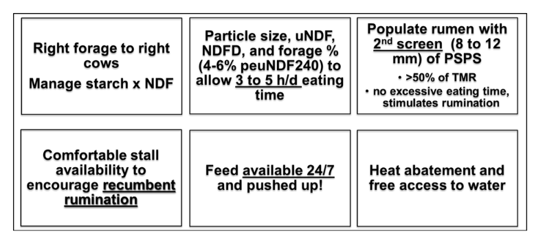

---
title: "Dairyconsult Meeting "
author: "Albart Coster"
date: "1-19-2026"
engine: knitr
format:
  revealjs:
    scrollable: true
lang: nl
output-dir: docs
bibliography: bib_albart.json
css: styles.css
--- 

```{r}
#| label: start
#| echo: false
#| results: 'hide'
#| warning: false
packages <- c("echarts4r",
              "openxlsx",
              "dplyr",
              "stringr",
              "gt")
installed_packages <- packages %in% rownames(installed.packages())
if (any(installed_packages == FALSE))
  install.packages(packages[!installed_packages])
invisible(lapply(packages, library, character.only = TRUE))
```

## Cowcatcher

- Yolov11 model trained on mounting cows
- Open source software
- Only cost: PC + wires + camera
- Thing sends messages to your phone when it 'sees' a mounting cow

See [https://github.com/CowCatcherAI/CowCatcherAI](https://github.com/CowCatcherAI/CowCatcherAI)

## Fiber in rations

- Our system: peNDF. This is %NDF in ration * % (upper 3 sieves of the Pennstate box)

Want to mention the article of @grant2025:

- peuNDF240: %(upper 3 sieves)*uNDF240. Goal 4-6%. Hence: with low uNDF240, longer particle length!
- Aim for 3-5 h/day eating time and >500 min ruminating
- Eating time and ruminating time conflict with each other: short eating time beneficial
- Emphasis on recumbent rumination!

```{r}
#| label: tab-1
#| echo: false
#| results: 'asis'
#| warning: false

tab0 <- data.frame(item = c('Long hay',
                            '50 mm rye hay',
                            '19 mm PSPS rye hay',
                            '8 mm PSPS rye hay',
                            '1.18 mm PSPS rye hay',
                            'Grass Silage',
                            'Corn Silage',
                            "TMR"),
                   NDF = c(51.7,
                           58.6,
                           57.9,
                           59.1,
                           54.2,
                           53.1,
                           48.1,
                           37.7),
                   size = c(NA,
                            42.2,
                            43.5,
                            25.1,
                            9.7,
                            13.8,
                            12,
                            13.1),
                   size_bolus = c(10.3,
                                  9.9,
                                  10.7,
                                  10.8,
                                  8.1,
                                  11.6,
                                  11.2,
                                  12.5),
                   chewsgram = c(2.6,
                                 3.5,
                                 2.2,
                                 1.7,
                                 1.9,
                                 .4,
                                 0.7,
                                 0.6)
                                 ) |> 
  gt(rowname_col = "item") |> 
  cols_label(NDF = "NDF %DM",
             size = "Feed particle size",
             size_bolus = "Bolus particle size",
            chewsgram = "Chews per gram")
tab0

tab1 <- data.frame(item = c("DMI, kg/d",
                            "Eating, min/d",
                            'Ruminating, min/d',
                            'Chewing, min/d',
                            'Resting, min/d'),
                   p40 = c(22.4,286,426,712,728),
                   p50 = c(21.5,292,454,745,695),
                   p60= c(20.3,342,471,813,627),
                   p70 = c(18.1,393,461,853,587))|> 
  gt(rowname_col = "item") |> 
  cols_label(p40 = "40%",
             p50 = "50%",
             p60="60%",
             p70 ="70%") |> 
  tab_spanner(
    label = md('Dietary forage (%DM)'),
    columns = 2:5)
tab1  
```


{width="50%"}

{width="50%"}

From: @grant2025 and @grant2023

## References


