---
title: "Presentatie Studiegroep Ommen"
author: "[albart@dairyconsult.nl](mailto:albart@dairyconsult.nl)"
  
date: "1-27-2026"
engine: knitr
format:
  revealjs:
    scrollable: true
lang: nl
auto-stretch: false
output-dir: docs
bibliography: bib_albart.json
css: styles.css
--- 

```{r}
#| label: start
#| echo: false
#| results: 'hide'
#| warning: false
packages <- c("echarts4r",
              "openxlsx",
              "dplyr",
              "stringr",
              "gt")
installed_packages <- packages %in% rownames(installed.packages())
if (any(installed_packages == FALSE))
  install.packages(packages[!installed_packages])
invisible(lapply(packages, library, character.only = TRUE))
load("beelden/20260127_grafieken.Rda")
```

## Inhoud

Voorwaarden voor hoge melkproductie: gezonde koeien

- Goede penswerking
- Deeltjesgrootte van rantsoen
- Vreet- en ligtijd
- Kwaliteit van (ruw)voer
- Goede transitie

## Penswerking

Penswerking: Voorwaarde voor een gezonde koe:

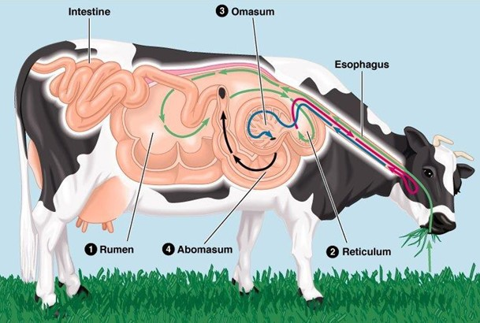{width="50%"}


## Penswerking in CVB

Belang van penswerking in CVB systeem, opbouw DVE:

$\textrm{DVE} = \textrm{DVBE} + \textrm{DVME} - \textrm{DVFE}$

$\textrm{DVME} = 0.75\cdot0.85\cdot\textrm{MREE}$

$\textrm{MREE} = 0.15\cdot{FOS}$

```{r}
#| label: "tab-MREE"
#| echo: false
#| results: 'asis'

tabgs <- data.frame(name = c("graskuil",
                             "maiskuil",
                             "perspulp",
                             "soja 44/7"),
                    RE = c(212,72,84,426),
                    DVE = c(75,59,93,219),
                    FOS = c(571,503,600,531)) |> 
  mutate(DVME = FOS * 0.85*0.75) |> 
  gt(id = "een",rowname_col = "name") |> 
  fmt_number(columns = DVME,decimals = 2)
tabgs
```

::: rf
Bron: @cvb2016
:::

## Penswerking en Energie

- Vezel, NDF: 100% van verteerbare NDF
- Zetmeel: 100% van pensafbreekbaar zetmeel
- Vet: weinig
- Eiwit: afhankelijk van situatie

Echter: grondstoffen beïnvloedden elkaar enorm


## Penswerking en B-vitamines

```{r}
#| label: "tab-B-vits"
#| echo: false
#| results: 'asis'

tabvits <- data.frame(name = c("Thiamine, B1",
                             "Riboflavine, B2",
                             "Niacine, B3",
                             "Vit B6",
                             "Biotine",
                             "Foliumzuur",
                             "Vit B12"),
                    Opname = c("1.3-3.8",
                               "4-106",
                               "22-170",
                               "2.6-17.6",
                               "0.2-7",
                               "0.2-1.1",
                               "--"),
                    'Dunne darm' = c("0.8-7.8",
                                 "3-87",
                                 "47-146",
                                 "0.7-7.7",
                                 "0.2-6.6",
                                 "0.9-2.4",
                                 "0.1-4.8"),
                    Penssynthese = c("-1.5-4.2",
                                     "-50-29",
                                     "-123-120",
                                     "14.1-1.3",
                                     "-0.9-0.2",
                                     "0.5-1.7",
                                     "0.1-4.8"),
                    Behoefte = c("150-300",
                                 "--",
                                 "12 gram/dag",
                                 "--",
                                 "20 mg/dag",
                                 "42mg/dag",
                                 "--")) |> 
  gt(id = "vits",rowname_col = "name")
tabvits
```

::: rf
Bron: @nrc2021
:::
                        
## Deeltjesgrootte van rantsoen, herkauwen en vreettijd

$$\textrm{peNDF} = \textrm{%NDF}\cdot \textrm{% bovenste 3 bakken }$$

Nieuwe inzichten uit stuk van @grant2025:

$$\textrm{peuNDF240} = \textrm{%uNDF240}\cdot \textrm{% 3 bakken}$$ Doel 4-6%. Dus: met weinig uNDF240, langere deeltjes!!

- Streef naar 3-5 u/dag eten en >500 min/dag herkauwen
- Vreettijd en eettijd conflicteren met elkaar
- Nadruk op liggend herkauwen!!

```{r}
#| label: tabdeeltjes
#| echo: false
#| results: 'asis'
#| warning: false

tabD <- data.frame(item = c('roggehooi',
                            '50 mm roggehooi',
                            '19 mm PSPS roggehooi',
                            '8 mm PSPS roggehooi',
                            '1.18 mm PSPS roggehooi',
                            'Kuilgras',
                            'Mais',
                            "TMR"),
                   NDF = c(51.7,
                           58.6,
                           57.9,
                           59.1,
                           54.2,
                           53.1,
                           48.1,
                           37.7),
                   size = c(NA,
                            42.2,
                            43.5,
                            25.1,
                            9.7,
                            13.8,
                            12,
                            13.1),
                   bolus = c(10.3,
                                  9.9,
                                  10.7,
                                  10.8,
                                  8.1,
                                  11.6,
                                  11.2,
                                  12.5),
                   chews = c(2.6,
                                 3.5,
                                 2.2,
                                 1.7,
                                 1.9,
                                 .4,
                                 0.7,
                                 0.6)
                                 ) |> 
  gt(rowname_col = "item") |> 
  cols_label(NDF = html("NDF<br> %DM"),
             size = html("Deeltjes<br>mm"),
             bolus = html("Bolus<br>mm"),
            chews = html("Kauwen per gram<br>NDF")) |> 
    sub_missing(
    columns = 1:4,
    missing_text = ""
  )

tabD

tab1 <- data.frame(item = c("Opname, kg/d",
                            "Vreettijd, min/d",
                            'Herkauwtijd, min/d',
                            'Kauwtijd, min/d',
                            'Rusttijd, min/d'),
                   p40 = c(22.4,286,426,712,728),
                   p50 = c(21.5,292,454,745,695),
                   p60= c(20.3,342,471,813,627),
                   p70 = c(18.1,393,461,853,587))|> 
  gt(rowname_col = "item") |> 
  cols_label(p40 = "40%",
             p50 = "50%",
             p60="60%",
             p70 ="70%") |> 
  tab_spanner(
    label = md('Percentage ruwvoer (%DM)'),
    columns = 2:5)
tab1  
```


::: rf
Bron: @grant2025 and @grant2023
:::

## Licht bewijs

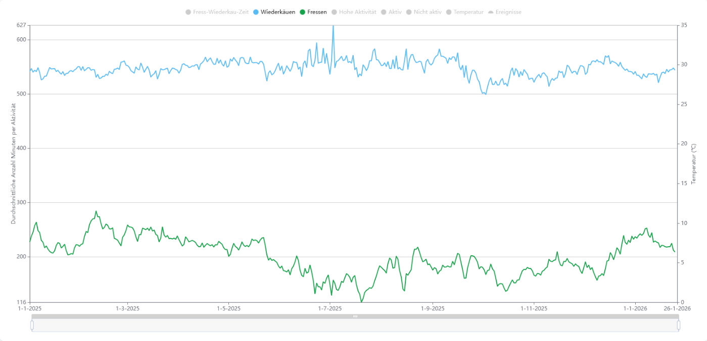{width="80%"}
```{r}
#| label: "grafiek_productie"
#| echo: false
#| results: 'asis'

g1
```

## Ligtijd

Cuciale belang van liggend herkauwen, @grant2025

Daarvoor:

**Ruime, comfortabele én schone ligboxen**

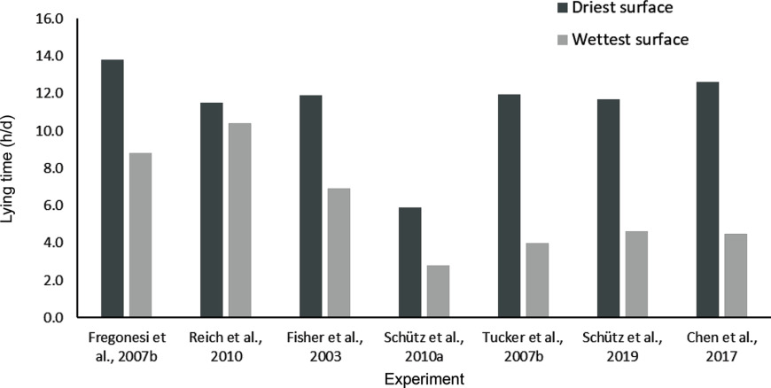{width="80%"}
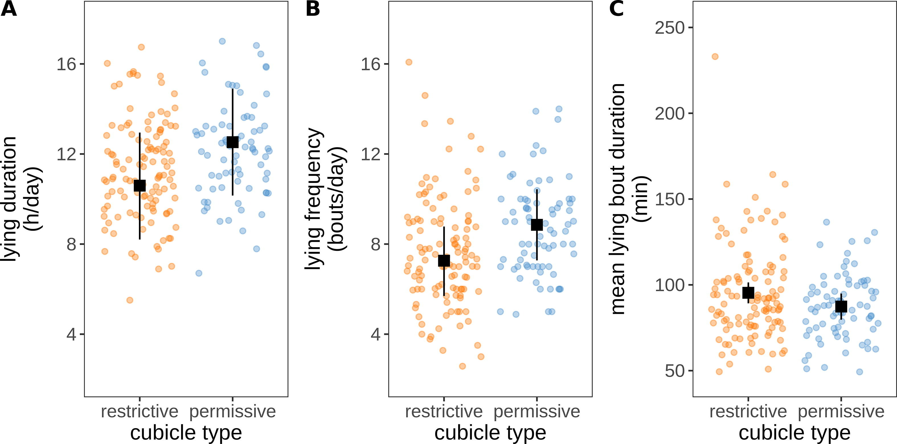{width="80%"}
```{r}
#| label: tabknieboom
#| echo: false
#| results: 'asis'
#| warning: false

tab <- data.frame(name = c("Ligtijd, u/dag",
                           "Aantal ligmomenten, #/dag",
                           "Lengte ligmoment, min/dag",
                           "Statijd, min/dag"),
                  GK = c(12.8,
                               8.3,
                               1.7,
                               97),
                  WK = c(11.6,
                         8.7,
                         1.5,
                         119)) |> 
  gt(rowname_col = "name") |> 
  tab_header(title = "Liggedrag in verschillende ligboxen") |> 
  tab_spanner(label = "Knieboom",columns  = c(2:3))|> 
  cols_label(GK = html("Geen knieboom"),
             WK = html("Wel knieboom"))
```

::: {.r-stack}

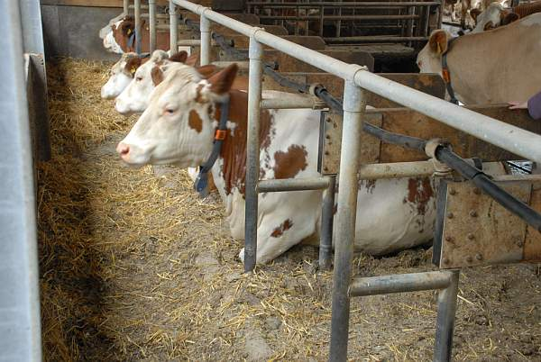{.fragment width="450" height="300"}

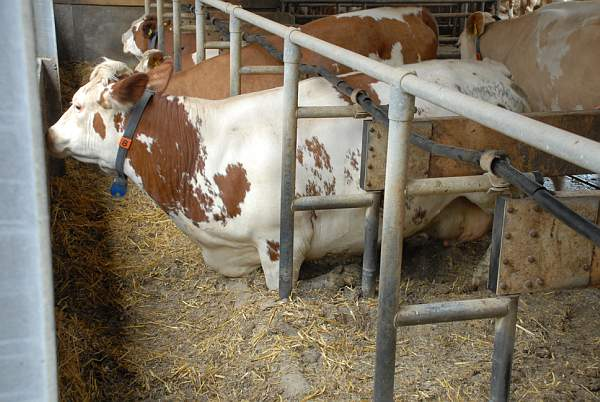{.fragment width="450" height="300"}

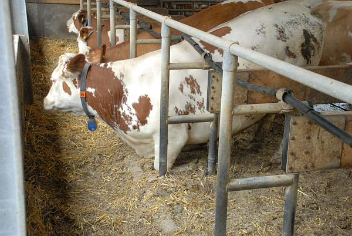{.fragment width="450" height="300"}

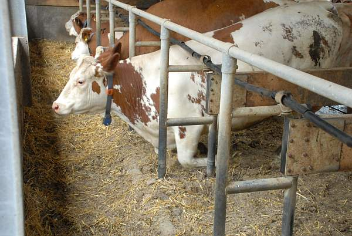{.fragment width="450" height="300"}

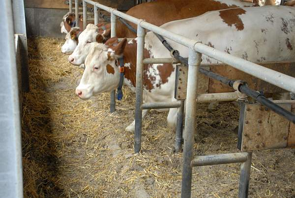{.fragment width="450" height="300"}

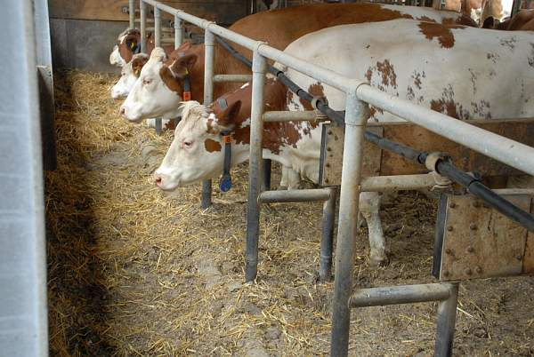{.fragment width="450" height="300"}
:::

{.fragment width="450" height="300"}

**Voldoende ligboxen**
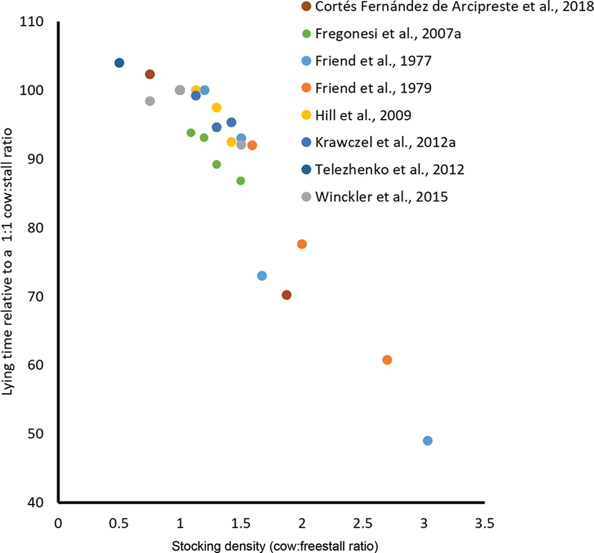{width="80%"}

Ook erg belangrijk voor melkproductie!!!

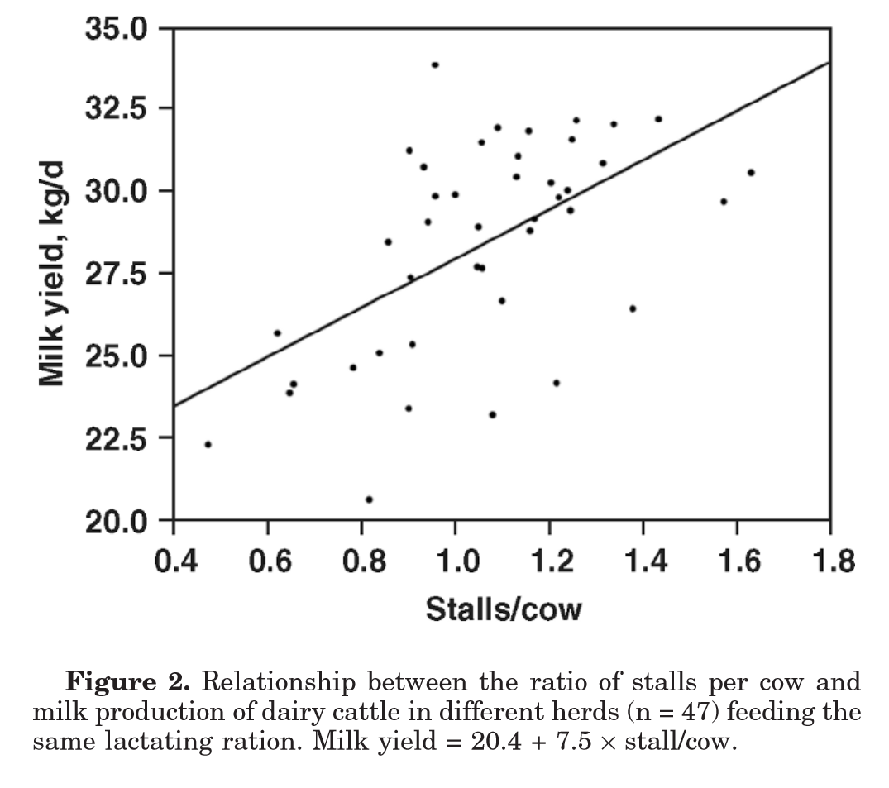{width="80%"}


**Dagindeling moet liggen bevorderen**

```{r}
#| label: tabligtijd
#| echo: false
#| results: 'asis'
#| warning: false

tab1
```

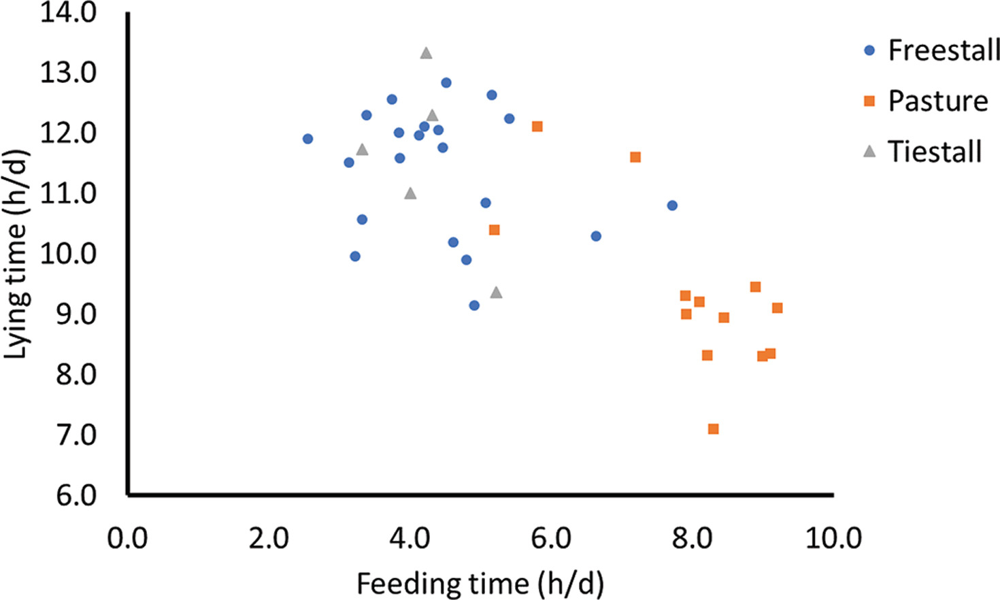{width="80%"}

::: rf
Bronnen: @Bach2008,@tucker2021,@brouwers2024,@grant2025
:::

## Goed en gezond ruwvoer

Algemeen: dunne mest => pensverzuring. Is dit altijd zo??

[Dunne mest kan ook duiden op mislukt (ruw)voer](https://balchem.com/wp-content/uploads/2026/01/Manure_Evaluation_Figuring_Out_Whats_Going_on_Between_Cows__Their_Rations.pdf.pdf)

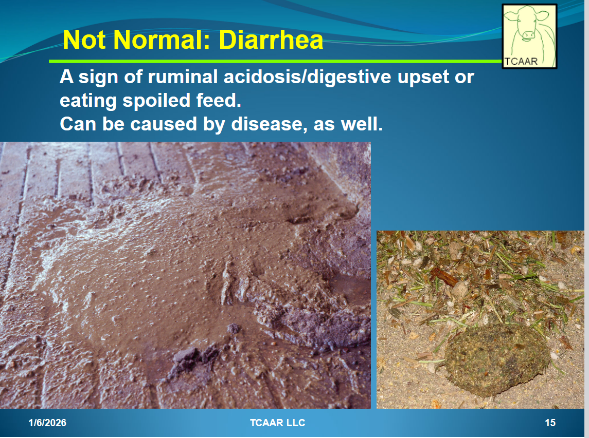{width="60%"}

Nog wat andere aanwijzingen:

{width="60%"}
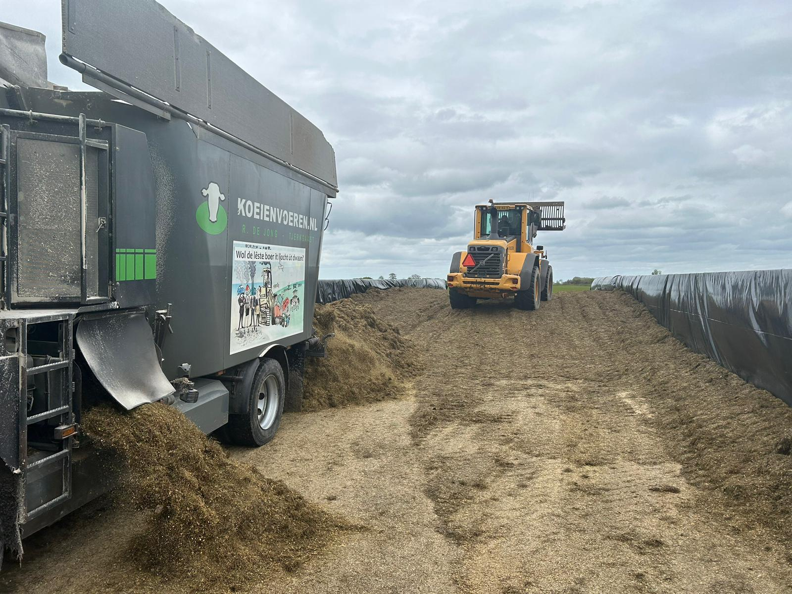{width="60%"}
```{r}
#| label: "grafiek_jerseys"
#| echo: false
#| results: 'asis'

gkuhpon
```

## Voerkwaliteit


```{r,echo=FALSE,results='asis'}
tabl1 <- read.xlsx("beelden/20251103_tabellen.xlsx",
                   sheet = "tab1lima2017",
                   colNames = TRUE)

tabl1 |>
  gt(id="eight",rowname_col = "Item") |> 
    tab_header("Eigenschappen van de folie.")


tabl3 <- read.xlsx("beelden/20251103_tabellen.xlsx",
                   sheet = "tab3lima2017",
                   colNames = TRUE) 

tabl3 |> gt(id = "nine",rowname_col = 'item') |> 
  tab_header("Eigenschappen van het ruwvoer.")

tabl4 <- read.xlsx("beelden/20251103_tabellen.xlsx",
                   sheet = "tab4lima2017",
                   colNames = TRUE)

tabl4 |> gt(id = "ten",rowname_col = 'item') |> 
  tab_header("Kwaliteit van de snijmais.") 
```

::: rf
Bron: @Lima2017
:::

## Belang van goed ruwvoer

Redenen waarom goed ruwvoer belangrijk is:

1. Diergezondheid
2. Conservering van nutriënten
3. Mestboekhouding

## 1. Diergezondheid:

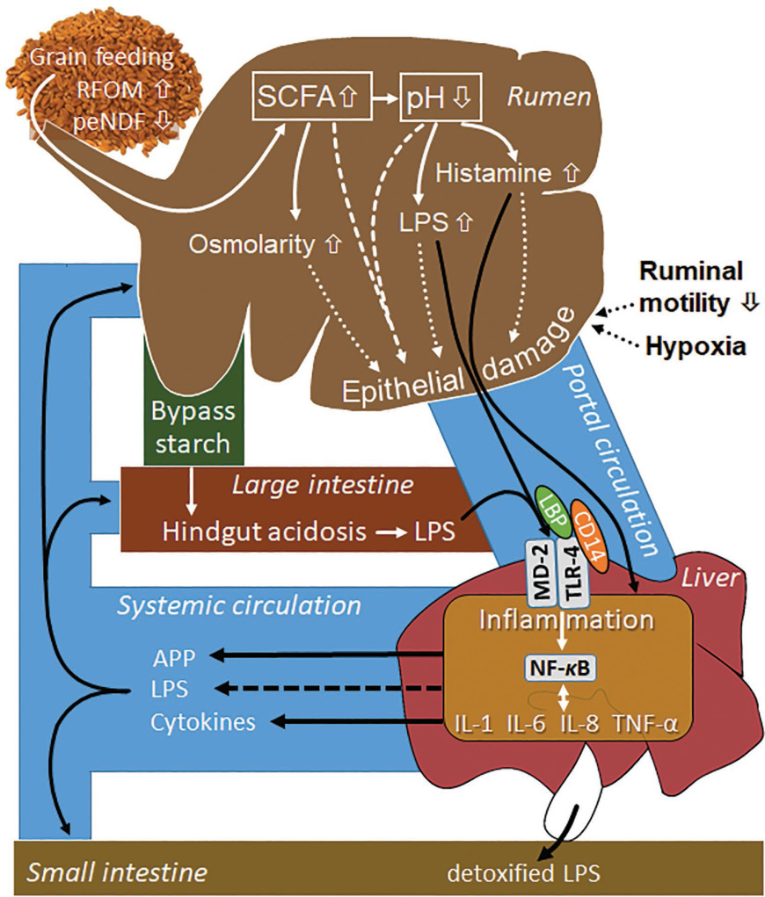{width="30%"}

::: rf
Bron: @aschenbach2019
:::

```{r,echo=FALSE,results='asis'}
t1 <- data.frame(Kenmerk = c("LPS",
                             "Methylalanine",
                             "Putrescine",
                             "Cadaverine",
                             "Histamine"),
                 basis= c(14692,37.3,14,15.9,2.03),
                 Sara1 = c(131209,37.3,32.2,24.2,13),
                 Sara2 = c(168285,46,30.7,24.3,5.19))
gt(t1)
```

::: rf
Bron: @humer2018
:::


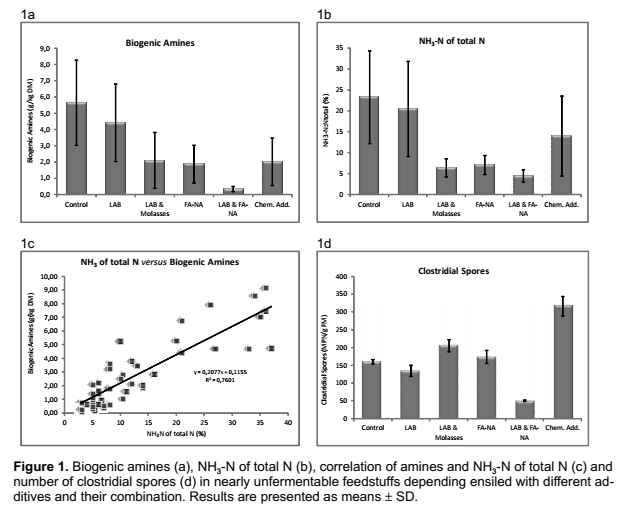

::: rf
Bron: @pieper2009
:::

## Conservering van nutriënten


- Conservering van nutriënten 
- Goede BEX

## 


## Verwijzingen


