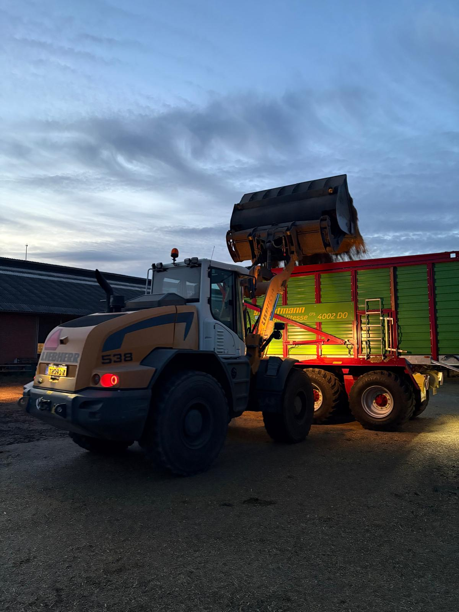

---
title: "Dairyconsult Meeting "
author: "Albart Coster"
date: "2-16-2026"
engine: knitr
format:
  revealjs:
    scrollable: true
lang: nl
output-dir: docs
bibliography: bib_albart.json
css: styles.css
--- 

```{r}
#| label: start
#| echo: false
#| results: 'hide'
#| warning: false
packages <- c("echarts4r",
              "openxlsx",
              "dplyr",
              "stringr",
              "gt")
installed_packages <- packages %in% rownames(installed.packages())
if (any(installed_packages == FALSE))
  install.packages(packages[!installed_packages])
invisible(lapply(packages, library, character.only = TRUE))
```

## Content

- Cowcatcher: see the results
- New apps available, small demo
- Feeding hay
- Mixed silage at Engelen

## Cowcatcher

- Let's go to anydesk

## New apps:

- [Dashboard production](https://dashboard.costeranalytics.nl/dashboard_klein/)
- [Dashboard Milk Controls](https://dashboard.costeranalytics.nl/dashboard_productie_rhino/)
- [Custom Dashboard for claw health](https://dashboard.costeranalytics.nl/dashboard_klauwen_wv/)

## Feeding hay

Objective: feed required ME and MP. Generally, ME is easier and cheaper than MP. Feeding Hay would be a wonderful substitute for grass silage:

- High pH, no feed intake depression due to acids
- High sugar; cheaper than adding sugar to the ration
- High MP due to low RDP
- Sometimes, high Vit D3

Therefore: we will propose clients to harvest a small part of very high quality grass as (wrapped) bales

What can you expect:

Melkbrouwer, 2013
<iframe src="pdfs/2013_gras_SS4.pdf" width="80%" height = "500pt" ></iframe>

Van Leeuwen, 2025
<iframe src="pdfs/4eSnede2025_367204_Leeuwen_5754PX_Grasingekuild_20250929.pdf" width="80%" height = "500pt" ></iframe>

## Science behind hay


```{r}
#| labe: "tabsbauer2025"
#| echo: false
#| results: asis

tabb2 <- read.xlsx("beelden/20251103_tabellen.xlsx",
                   sheet = "tab2bauer2025",
                   colNames = TRUE)

tabb2 |> 
  filter(!is.na(Silage))|> 
  gt(id = "tab2bauer2025") |> 
  tab_row_group("Intake of DM (kg/d)",rows = 1:3) |> 
  tab_row_group("Intake of nutrients (kg/d",rows = 4:10) |>
  tab_header("Least squares means for the effects of silage and hay on dairy cows' intake of DM, nutrients, and energy")

tabb4 <- read.xlsx("beelden/20251103_tabellen.xlsx",
                   sheet = "tab4bauer2025",
                   colNames = TRUE)

tabb4 |> 
  filter(!is.na(Silage)) |> 
  gt(id = "tab4bauer2025") |> 
  tab_row_group("Milk parameters",rows = 1:11) |> 
  tab_row_group("BW and BCS",rows = 12:17) |> 
  tab_row_group("Efficiency and balances",rows = 18:21) |> 
  tab_header("Least squares means for the effects of silage and hay on dairy cows' performance, body condition, energy balance, and efficiency.")

tabb5 <- read.xlsx("beelden/20251103_tabellen.xlsx",
                   sheet = "tab5bauer2025",
                   colNames = TRUE)

tabb5 |> 
  gt(id = "tab5bauer2025") |>
  tab_header("Least squares means for the effects of silage and hay on pH and VFA concentrations in feces.")
```


Also, Vitamin D3

```{r}
#| labe: "tab-vitD"
#| echo: false
#| results: asis


tabnl <- read.xlsx("beelden/20251103_tabellen.xlsx",
                   sheet = "tab2newlander1952",
                   colNames = TRUE)

tabnl |> 
    select(-c(No,Gewas)) |> 
  gt(id="five") |> 
  tab_row_group("Bromegrass and Alfalfa, cut 28/6/1950 7:00",
                rows = 1:4) |> 
  tab_row_group("2e C. Alfalfa, cut 15/8-1950 7:00",
                rows = 5:7) |> 
  tab_row_group("Bromegrass, cut 21-6-1951 13:30",
                rows = 8:10) |> 
  tab_row_group("Alfalfa, cut 21-6-1951 13:30",
                rows = 11:13) |> 
  tab_row_group("Bromegrass, cut 11-7-1951 11:00",
                rows = 14:16) |> 
  tab_header(title = "Influence of time and wheather ond Vit D3 content in grasses") 
```

::: rf
Sources: @Newlander1952 and @bauer2025
:::

## Mixed Silage at Engelen:

Mixed Silage  
<iframe src="pdfs/20251208_mengkuil_Ospel.pdf" width="80%" height = "500pt" ></iframe>


Ration
<iframe src="pdfs/20251222_rantsoen_mengkuil.pdf" width="80%" height = "500pt" ></iframe>




## References


