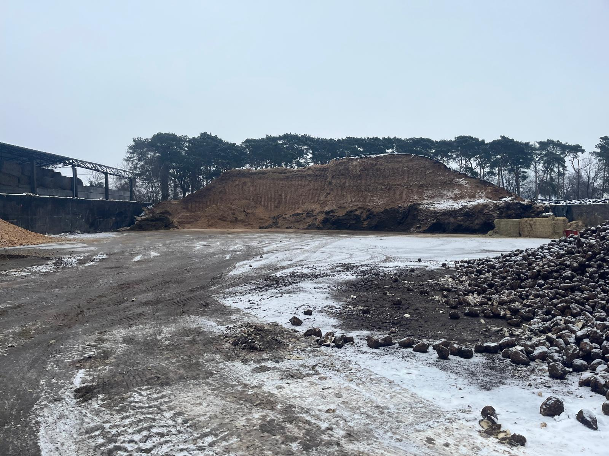
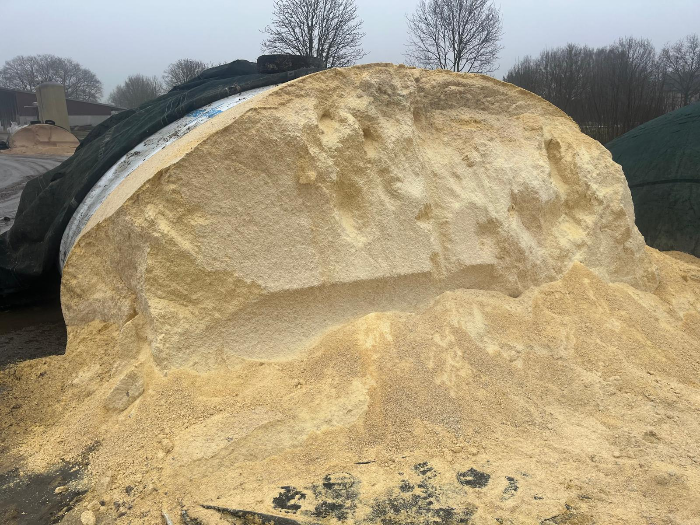
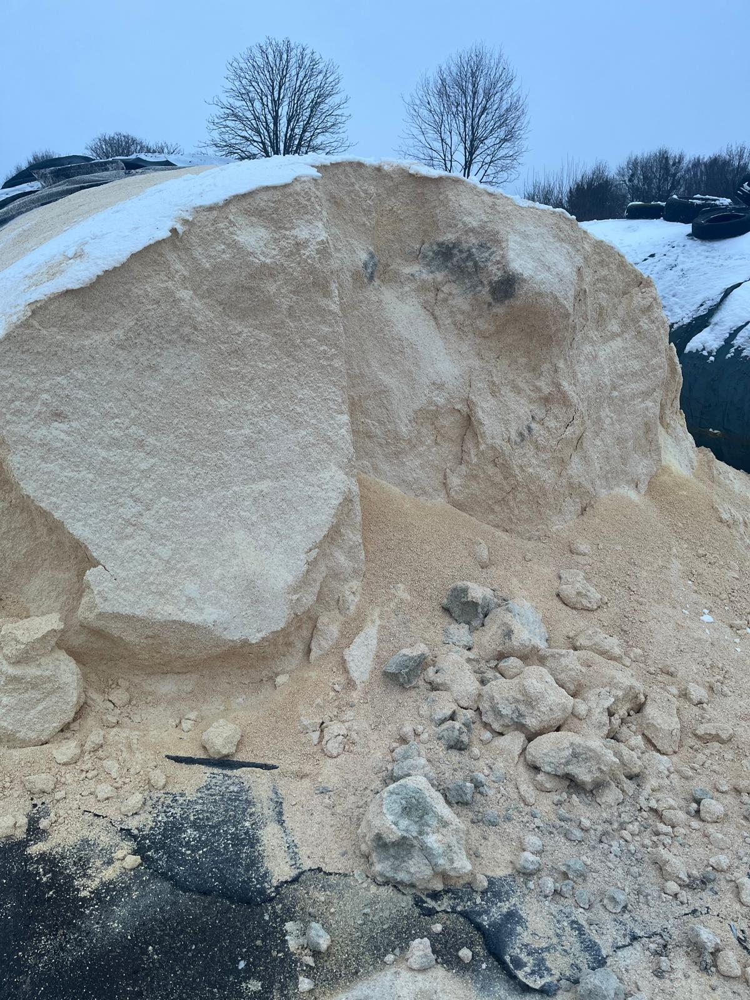
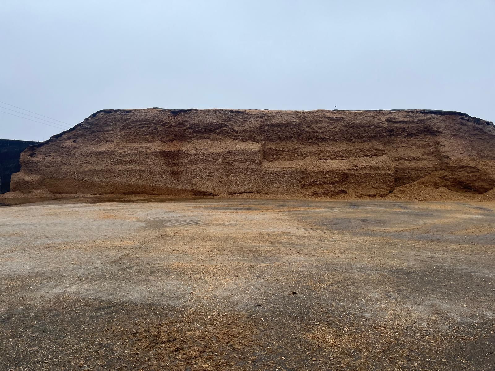
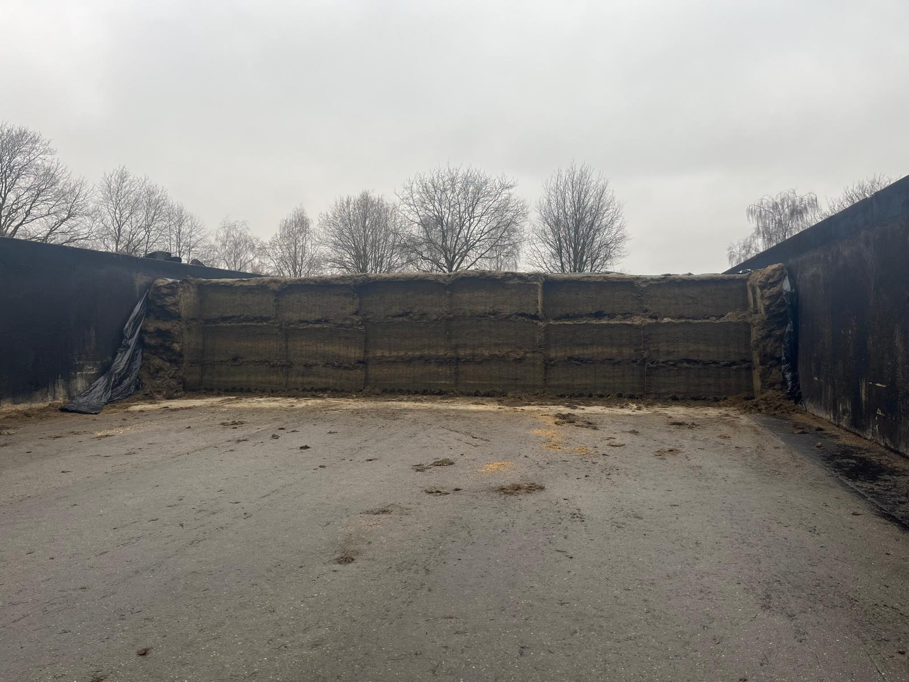

---
title: "Grundfutter 2025-2026, Hof Karp"
author: "[albart@dairyconsult.nl](mailto:albart@dairyconsult.nl)"
  
date: "2-19-2026"
engine: knitr
format:
  revealjs:
    scrollable: true
lang: de
auto-stretch: false
output-dir: docs
bibliography: bib_albart.json
css: styles.css
--- 

```{r}
#| label: start
#| echo: false
#| results: 'hide'
#| warning: false
packages <- c("echarts4r",
              "openxlsx",
              "dplyr",
              "tidyr",
              "stringr",
              "gt")
installed_packages <- packages %in% rownames(installed.packages())
if (any(installed_packages == FALSE))
  install.packages(packages[!installed_packages])
invisible(lapply(packages, library, character.only = TRUE))
```

## Inhalt

- Evaluierung Silages 2025
- Evaluierung Leistung 2025 Kraak
- Evaluierung Leistung 2025 Goldenstädt
- Ausblick Grundfutter 2026:
  - Ackergrass
  - Wiesengrass
  - Herbstgrass
  - Silages Fahrbinde
  - Silages für Trockensteher
- Faser und Partikelgröße
- Silage, Verdichtung und Qualität
- Evaluierung Einstreu Kraak und Goldenstädt
- Ausblick Einstreu

## Silages 2025

**1e Schnitt Ackergrass 2025**


<details>
<summary>Links war sehr nass</summary>
<iframe src="pdfs/1 Schnitt links 10231075 STD.pdf" width="95%" height = "600pt" ></iframe>
</details>


<details>
<summary>Rechts viel trockner</summary>
<iframe src="pdfs/1 Schnitt Ackergras rechts 10231076 STD.pdf" width="95%" height = "600pt" ></iframe>
</details>

## Silages 2025

**4e S. 2025**


<details>
<summary>Auch eine Misschung</summary>
<iframe src="pdfs/4 Schnitt 2025 Gras 10235577 STD.pdf" width="95%" height = "600pt" ></iframe>
</details>

## Silages 2025

4e S. 2025 hat nicht gut gelaufen in der Trockenstand. Es gab noch Grass Grambow 2023:



<details>
<summary>Grass Grambow 2023</summary>
<iframe src="pdfs/Grambow Grassilage 10222549 STD.pdf" width="95%" height = "600pt" ></iframe>
</details>

<details>
<summary>Ration mit 4e S. 2025</summary>
<iframe src="pdfs/20251128_Ration_VB.pdf" width="95%" height = "600pt" ></iframe>
</details>

<details>
<summary>Ration mit Grass Grambow 2023</summary>
<iframe src="pdfs/20260121_Ration_VB.pdf" width="95%" height = "600pt" ></iframe>
</details>

```{r}
#| label: "transit"
#| echo: false
#| results: asis

tabt <- read.xlsx("beeld_hk/data_hk.xlsx",
                   sheet = "transit",
                  detectDates = T,
#                  col_types = c("date","numeric","numeric","numeric"),
                   colNames = TRUE) |> 
  mutate(mf = mf/kalbung*100,
         ng = ng/kalbung*100) |> 
  e_charts(datum) |> 
  e_bar(mf) |> 
  e_bar(ng)
tabt
```

## Silages 2025

**Silo am Feld**


**Fahrbinde**


**Grunroggen**

- Keine Analyse
- ~20% TS, hat gut gelaufen

Nächstes Jahr; gerne Trockner

## Silages 2025

**Mais**

{width=50%}

{width=50%}
{width=50%}

{width=50%}
{width=50%}
{width=50%}

## (Mais)silage

Verdichtung, Sauerstoff und Qualität

{width=50%}


::: rf
Quelle: [https://shorturl.at/xmfVM](https://shorturl.at/xmfVM)
:::


::: {.callout-note appearance='simple'}

## Übersetzung

Der neue Trend der Hochsilos auf Plattformen ist keineswegs nur eine Modeerscheinung, sondern die neue Realität! Die Steigerung der Dichte pro Kubikmeter und die unvergleichliche Verbesserung der Fermentation begeistern jeden, der es ausprobiert... und das sage nicht nur ich, das belegen die Analysen zusammen mit den Ergebnissen der Milchleistung! Also gewöhnt euch lieber gleich daran... und zwar ALLE!
:::


Und auch die Präsentation von Mary Beth Hall, min 17:30:




```{r}
#| label: "folie"
#| echo: false
#| results: asis

tabl1 <- read.xlsx("beelden/20251103_tabellen.xlsx",
                   sheet = "tab1lima2017",
                   colNames = TRUE)

tabl1 |>
  gt(id="eight",rowname_col = "Item") |> 
    tab_header("Folie.")


tabl3 <- read.xlsx("beelden/20251103_tabellen.xlsx",
                   sheet = "tab3lima2017",
                   colNames = TRUE) 

tabl3 |> gt(id = "nine",rowname_col = 'item') |> 
  tab_header("Silage.")

tabl4 <- read.xlsx("beelden/20251103_tabellen.xlsx",
                   sheet = "tab4lima2017",
                   colNames = TRUE)

tabl4 |> gt(id = "ten",rowname_col = 'item') |> 
  tab_header("Futterqualität.") 
```

::: rf
Quelle: @Lima2017
:::

## Praxis

**Verdichtung und Futterqualität**

```{r}
#| label: "dichthied"
#| echo: FALSE
#| results: 'asis'

tabd <- read.xlsx("beeld_hk/data_hk.xlsx",
                   sheet = "verdichtung",
                  detectDates = T,
                   colNames = TRUE) |> 
  group_by(Kunde,Ort) |> 
  e_charts(Ort) |> 
  e_bar(Dichte) |> 
  e_axis_labels( x="Ort",y = "Dichte (g/L)")
tabd

tabq <- read.xlsx("beeld_hk/data_hk.xlsx",
                   sheet = "GP",
                  detectDates = T,
                   colNames = TRUE) |>
  gt(id = "fq",rowname_col = 'X1') |> 
  tab_header("Futterqualität.")
tabq

```

## CCM





## Goldenstädt

**Mais**, sehr trocken. Versorgung sehr gut

<details>
<summary>Mais GS</summary>
<iframe src="pdfs/gs_mais_2024.pdf" width="95%" height = "600pt" ></iframe>
</details>



{style="transform: rotate(90deg);"}
{style="transform: rotate(90deg);"}

## Goldenstädt

**Grass**, versorgung sehr gut:


<details>
<summary>Grass GS</summary>
<iframe src="pdfs/gs_grass2eS.pdf" width="95%" height = "600pt" ></iframe>
</details>





## Leistung Kraak und Goldenstädt

<iframe 
  src="https://dashboard.costeranalytics.nl/dashboard_productie_rhino/" 
  width="110%" 
  height="700px" 
  style="border:none;">
</iframe>

- Nummer 1990031 für Hof Karp
- Nummer 9790576 für Goldenstädt


## Ausblick Grundfutter 2026, Ackergrass und Wiesengrass gute Qualität

Gerne etwas trocken, damit maximale Qualität:


```{r}
#| label: "tabsbauer2025"
#| echo: false
#| results: asis

tabb2 <- read.xlsx("beelden/20251103_tabellen.xlsx",
                   sheet = "tab2bauer2025",
                   colNames = TRUE)

tabb2 |> 
  filter(!is.na(Silage))|> 
  gt(id = "tab2bauer2025") |> 
  tab_row_group("Intake of DM (kg/d)",rows = 1:3) |> 
  tab_row_group("Intake of nutrients (kg/d",rows = 4:10) |>
  tab_header("Least squares means for the effects of silage and hay on dairy cows' intake of DM, nutrients, and energy")

tabb4 <- read.xlsx("beelden/20251103_tabellen.xlsx",
                   sheet = "tab4bauer2025",
                   colNames = TRUE)

tabb4 |> 
  filter(!is.na(Silage)) |> 
  gt(id = "tab4bauer2025") |> 
  tab_row_group("Milk parameters",rows = 1:11) |> 
  tab_row_group("BW and BCS",rows = 12:17) |> 
  tab_row_group("Efficiency and balances",rows = 18:21) |> 
  tab_header("Least squares means for the effects of silage and hay on dairy cows' performance, body condition, energy balance, and efficiency.")

tabb5 <- read.xlsx("beelden/20251103_tabellen.xlsx",
                   sheet = "tab5bauer2025",
                   colNames = TRUE)

tabb5 |> 
  gt(id = "tab5bauer2025") |>
  tab_header("Least squares means for the effects of silage and hay on pH and VFA concentrations in feces.")
```


## Ausblick Grundfutter 2026, Grass Allgemein

**Häcksellänge:**

- Bis jetzt: peNDF. %NDF in Ration * % (3 Obensieben Pennstate box)

In @grant2025:

- peuNDF240: %(3 Obenboxen)*uNDF240. Ziel 4-6%. Damit: mit niedrige uNDF240, langere Teilen!
- Ziel 3-5 Std/Tag fressen und >500 min/Tag Wiederkauen
- Fresszeit und Wiederkauzeit in Konliktieren: 
- Liegend Wiederkauen!

```{r}
#| label: tab-1
#| echo: false
#| results: 'asis'
#| warning: false

tab0 <- data.frame(item = c('Long hay',
                            '50 mm rye hay',
                            '19 mm PSPS rye hay',
                            '8 mm PSPS rye hay',
                            '1.18 mm PSPS rye hay',
                            'Grass Silage',
                            'Corn Silage',
                            "TMR"),
                   NDF = c(51.7,
                           58.6,
                           57.9,
                           59.1,
                           54.2,
                           53.1,
                           48.1,
                           37.7),
                   size = c(NA,
                            42.2,
                            43.5,
                            25.1,
                            9.7,
                            13.8,
                            12,
                            13.1),
                   size_bolus = c(10.3,
                                  9.9,
                                  10.7,
                                  10.8,
                                  8.1,
                                  11.6,
                                  11.2,
                                  12.5),
                   chewsgram = c(2.6,
                                 3.5,
                                 2.2,
                                 1.7,
                                 1.9,
                                 .4,
                                 0.7,
                                 0.6)
                                 ) |> 
  gt(rowname_col = "item") |> 
  cols_label(NDF = "NDF %DM",
             size = "Feed particle size",
             size_bolus = "Bolus particle size",
            chewsgram = "Chews per gram")
tab0

tab1 <- data.frame(item = c("DMI, kg/d",
                            "Eating, min/d",
                            'Ruminating, min/d',
                            'Chewing, min/d',
                            'Resting, min/d'),
                   p40 = c(22.4,286,426,712,728),
                   p50 = c(21.5,292,454,745,695),
                   p60= c(20.3,342,471,813,627),
                   p70 = c(18.1,393,461,853,587))|> 
  gt(rowname_col = "item") |> 
  cols_label(p40 = "40%",
             p50 = "50%",
             p60="60%",
             p70 ="70%") |> 
  tab_spanner(
    label = md('Dietary forage (%DM)'),
    columns = 2:5)
tab1  
```


{width="50%"}

{width="80%"}

::: rf
Quelle: @bauer2025 , @grant2025 und @grant2023
:::


## Ausblick Grundfutter 2026, Wiesengrass

- Perfektes Futter für Trockensteher, wenn Trocken einsiliert
- Auch perfect für Jungrinder!
- Dann gerne relativ Kürz Häckseln. 

## Ausblick Grundfutter 2026, Wiesengrass nasser

- Mit TS > 30%, einsilieren für MK Gerne immer mit 10% Mais (1 Schaufel/Hänger)
- Mit TS < 30%, einsilieren mit 20% Mais. Beobachten das Mais durch das Futter kommt

## Ausblick 2026, Jungrinder (Fahrbinde)

- Mais und Grass wegfuttert. 
- Bei jedem Ernte, 10-20 Mais versorgen von Kraak oder Goldenstädt. Durchmischen. Damit eine komplette Ration für die ältere Tiere, besseres Silomanagement, und, sehr wichtig, bessere Silages

{width="80%"}
{width="80%"}
{width="80%"}

## Ausblick 2026, Mais

- Perfekte verdichtung überall (>750 kg/m3; >260 kg TM/m3)
- Körner sehr gut gequetscht:



Und:


```{r}
#| label: "tabdichte"
#| echo: false
#| results: asis

tabD <- read.xlsx("beeld_hk/data_hk.xlsx",
                   sheet = "dichte",
                   colNames = TRUE) |> 
  mutate(hohe = as.numeric(hohe))|>
  mutate(perc_korner = paste(perc_korner,"% Körner")) |> 
  group_by(perc_korner) |> 
  e_charts(hohe) |> 
  e_line(dichte) |> 
  e_y_axis(max = 300 , min = 150) |> 
  e_x_axis(max = 3.5,min = 2.3) |> 
   e_axis_labels( x="Höhe",y = "Dichte (g/L)")
tabD
```


::: rf
Quelle: @damours2005
:::

## Ausblick 2026

Ideeen:

- Anbau Luzerne? Ziel NDF < 40%, RP > 20%. Gerne Trocken
- Anbau Teffheu? Viel Sucker, *Emergency crop*
- Mischung Grass + Mais für Jungrinder

## Liegeboxen

Liegend wiederkauen, @grant2025

Dafür:

**Große, bequame und saubere Liegeboxen**

{width="80%"}


[Einstreu auf Linkedin](https://www.linkedin.com/posts/threemile-canyon-farms_did-you-know-we-use-composted-solids-from-activity-7429245617983520769-y653?utm_source=share&utm_medium=member_desktop&rcm=ACoAAAT7UisBmSNlLCpNLn-1sNH7SCo9iTwR57E)


{width="80%"}
```{r}
#| label: tabknieboom
#| echo: false
#| results: 'asis'
#| warning: false

tab <- data.frame(name = c("Liegezeit, Stu/Tag",
                           "Liegemomenten, #/Tag",
                           "Länge Liegemoment, Min/Tag",
                           "Stehezeit, Min/Tag"),
                  GK = c(12.8,
                               8.3,
                               1.7,
                               97),
                  WK = c(11.6,
                         8.7,
                         1.5,
                         119)) |> 
  gt(rowname_col = "name") |> 
  tab_header(title = "Liegeverhalten in verschiedene Boxen") |> 
  tab_spanner(label = "Knieriegel",columns  = c(2:3))|> 
  cols_label(GK = html("Kein Knieriegel"),
             WK = html("Ja Knieriegel"))
```

::: {.r-stack}
{.fragment width="450" height="300"}

{.fragment width="450" height="300"}

{.fragment width="450" height="300"}

{.fragment width="450" height="300"}

{.fragment width="450" height="300"}

{.fragment width="450" height="300"}
:::

{.fragment width="450" height="300"}


**Genug Liegeboxen**
{width="80%"}

Sehr wichtig für Leistung!!!

{width="80%"}


**Kuh braucht genug Zeit für Liegen**

```{r}
#| label: tabligtijd
#| echo: false
#| results: 'asis'
#| warning: false

tab1
```

{width="80%"}

::: rf
Quellen: @Bach2008,@tucker2021,@brouwers2024,@grant2025
:::


## Einstreu

Goldenstädt:

{width="80%"}

Vorschlag, einsetzt Steinmehl oder Zeolith

- Bindet $\textrm{NH}_3$
- Gut für klauen
- Haltet Liegboxen frei von Keime und trocken
- Vielleicht später automatisieren, wie in Kuhpon??

## Kraak

Zellzahl, auch in GS wichtig

<iframe 
  src="https://dashboard.costeranalytics.nl/dashboard_productie_rhino/" 
  width="110%" 
  height="700px" 
  style="border:none;">
</iframe>


## Literaturliste


