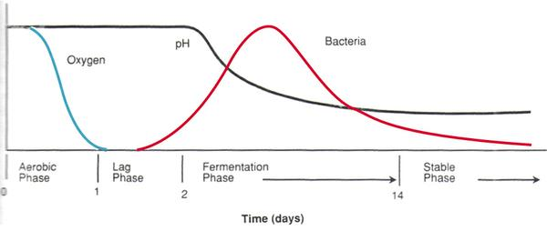
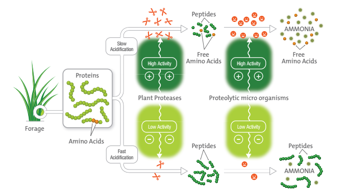
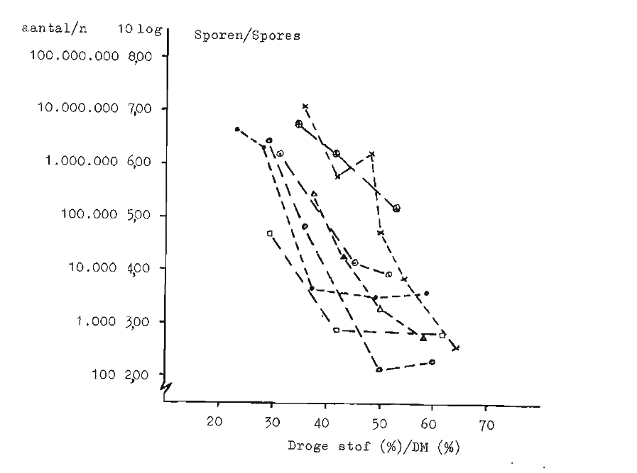
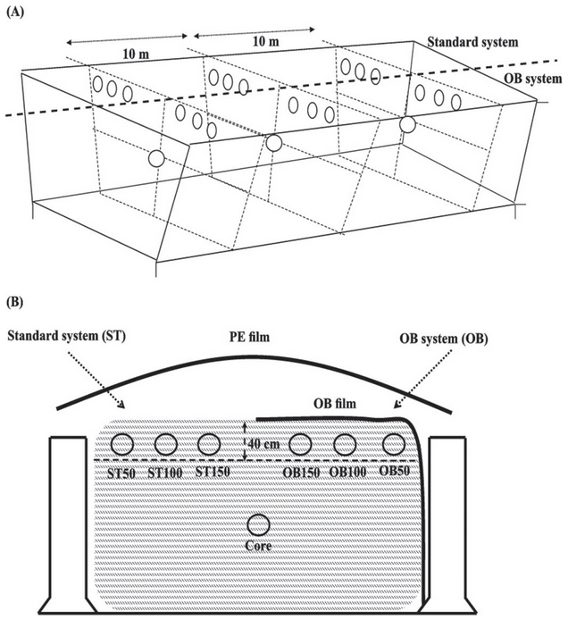
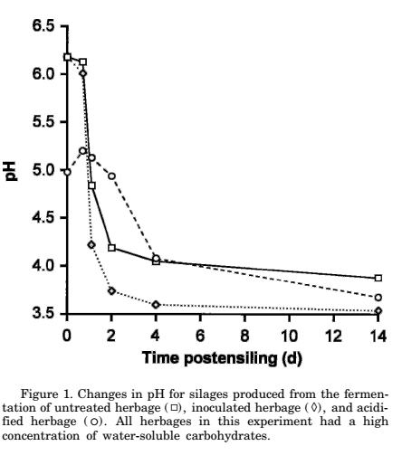
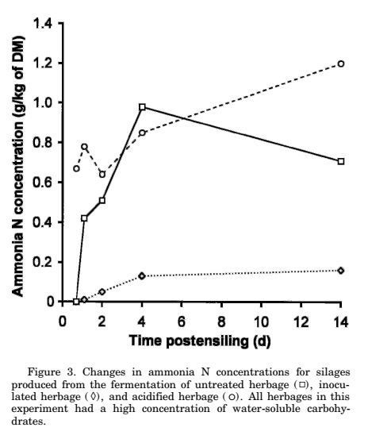
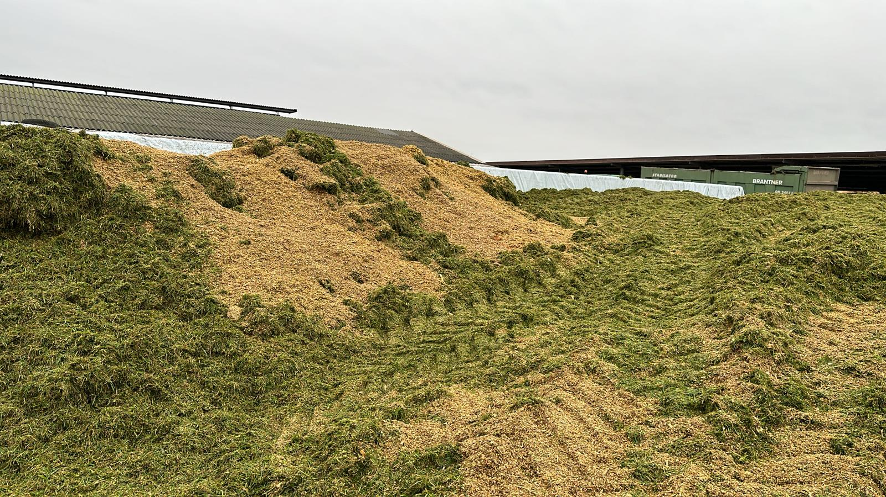
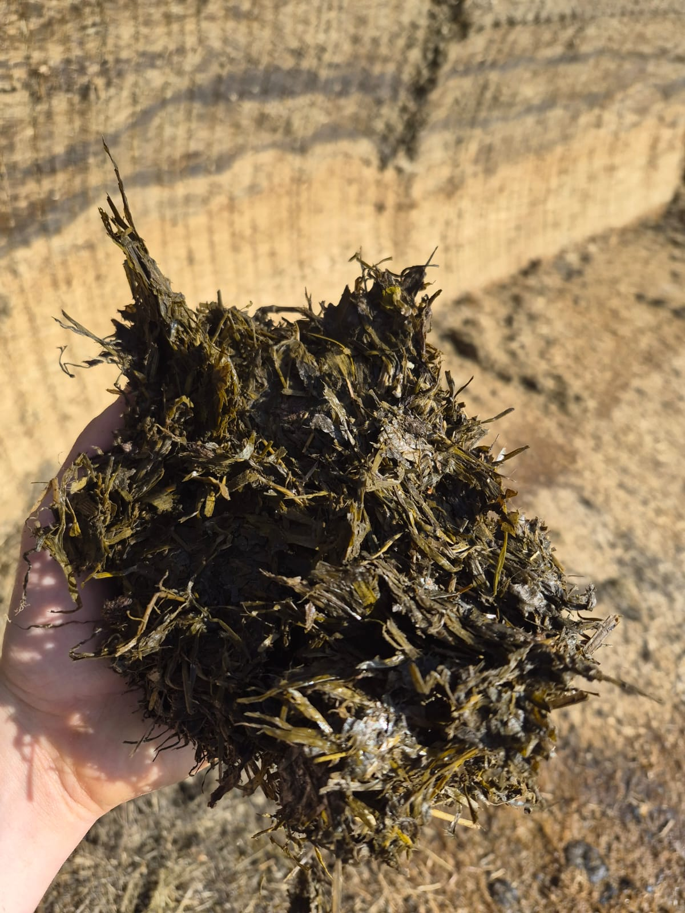
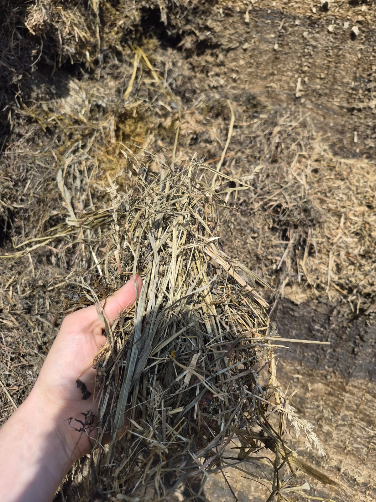

---
title: "Grundfutter Lübars Agrar "
author: "Albart Coster"
date: "3-31-2026"
engine: knitr
format:
  revealjs:
    scrollable: true
    auto-stretch: false
lang: de
output-dir: docs
bibliography: bib_albart.json
css: styles.css
--- 

```{r}
#| label: start
#| echo: false
#| results: 'hide'
#| warning: false
packages <- c("echarts4r",
              "openxlsx",
              "dplyr",
              "stringr",
              "gt")
installed_packages <- packages %in% rownames(installed.packages())
if (any(installed_packages == FALSE))
  install.packages(packages[!installed_packages])
invisible(lapply(packages, library, character.only = TRUE))
```

## Inhalt

- Ziele Grundfutter
- Evaluierung Silages 2025
- Ziele Grass, Roggen und Luzerne
- Ziele Mais
- Ausblick Grass, Roggen, und Luzerneernte
- Ausblick Maisernte

## Ziele Grundfutter

- Höhe Qualität
- Kein Verlust, Gammel, Schmutz
- Scheckhaft

## Was passiert beim Einsilieren

{width="90%"}

### Was passiert mit Eiweiß

{width="90%"}


::: rf
Quelle: [https://bit.ly/4d0JQ5I](https://bit.ly/4d0JQ5I)
:::


## Wie gelingt eine Grass-, Luzerne-, Roggensilage am besten?

- Wert trocken einsiliert
- Trocknet schnell am Feld
- Wert gut verdichtet
- Wert gut abgedeckt
- Konserviert damit schnell
- Wert gut und sauber aussiliert

## Trockensubstanz Silages

### Trockeneres Grundfutter wert besser gefressen

```{r}
#| label: "tabsbauer2025"
#| echo: false
#| results: asis

tabb2 <- read.xlsx("beelden/20251103_tabellen.xlsx",
                   sheet = "tab2bauer2025",
                   colNames = TRUE)

tabb2 <- tabb2 |> 
  filter(!is.na(Silage))|> 
  slice(1:3) |> 
  select(Item,Silage,Hay) |> 
  gt(id = "tab2bauer2025") |> 
 ## tab_row_group("TS Aufnahme (kg/d)",rows = 1:3) |> 
##  tab_row_group("Aufnahme Nährstoffe (kg/d",rows = 4:10) |>
  tab_header("Aufnahme von Silage und Heu.")
tabb2

```

### Trockenere Silage hat weniger Clostridien:

```{r}
#| label: "tabspoelstra1990"
#| echo: false
#| results: asis

tabb5 <- read.xlsx("beelden/20251103_tabellen.xlsx",
                   sheet = "tab2spoelstra1990",
                   colNames = TRUE)

tabb5 <- tabb5 |> 
  gt(id = "tab2spoelstra1990",  rowname_col = "Parameter") |> 
  cols_label(yesbutyric = "Mit Buttersäure",
             nobutyric = "Ohne Buttersäure") |> 
  tab_header("Durchschnitt von Silages ohne und mit Buttersäure.")

tabb5

```


{width="90%"}
{width="0%"}

### Trockenere Silage hat bessere Eiweißqualität:

```{r}
#| label: "tab2groseth2025"
#| echo: false
#| results: asis

df <- data.frame(item = c("TS","NH3","ATT20","PBV20"),
                 nTS = c(260,145,79,9),
                 hTS = c(417,115,83,-2)) |> 
  gt(id = "tab2groseth2025") |> 
  tab_header("Eiweißqualität nasse und trockene Silage.")

df

```


::: rf
Quellen: @Hengeveld1983,@spoelstra1990, @bauer2025,@groseth2025
:::


## Schnelle Trocknung auf Felt

Beim Trocknen geht Qualität verloren

```{r}
#| label: "tab-cavallarin"
#| echo: false
#| results: 'asis'


tabc <- read.xlsx("beelden/20251103_tabellen.xlsx",
                   sheet = "tab1cavallarin2005",
                   colNames = FALSE)

rc <- function(x){
  round(as.numeric(str_trim(gsub("[a-z]","",x))),2)
}

tabc |> 
  mutate(across(colnames(tabc)[-1],rc))|> 
  gt(id="three",rowname_col = "X1") |> 
  tab_stubhead(label = "Zahl") |> 
  tab_header(title = "Einfluß aufbereitung und trocknung auf Qualität Sainfoin.")|> 
  tab_spanner(label = "Nicht aufbereitet",columns  = c(X3:X5)) |> 
  tab_spanner(label = "Aufbereitet",columns  = c(X6:X8)) |> 
  cols_label(X2 = "0 Std",
             X3 = "25 Std",
             X4 = "71 Std",
             X5 = "77 Std",
             X6 = "5 Std",
             X7 = "25 Std",
             X8 = "29 Std") |> 
  opt_css(
    css = "
    .cell-output-display {
      overflow-x: unset !important;
    }
    div#two {
      overflow-x: unset !important;
      overflow-y: unset !important;
    }
    #two .gt_col_heading {
      position: sticky !important;
      top: 0 !important;
    }
    ")
```

::: rf
Quelle: @Cavallarin2005
:::

## Anmerkung: Vitamin D

Vitamin D im Grass steigt mit längere Feldperiode

```{r}
#| labe: "tab-vitD"
#| echo: false
#| results: asis


tabnl <- read.xlsx("beelden/20251103_tabellen.xlsx",
                   sheet = "tab2newlander1952",
                   colNames = TRUE)

tabnl |> 
    select(-c(No,Gewas)) |> 
  gt(id="five") |> 
  tab_row_group("Madrid Trespe und Luzerne, gemäht auf 28/6/1950 7:00",
                rows = 1:4) |> 
  tab_row_group("2e S. Luzerne, gemäht auf 15/8-1950 7:00",
                rows = 5:7) |> 
  tab_row_group("Madrid Trespe, gemäht auf 21-6-1951 13:30",
                rows = 8:10) |> 
  tab_row_group("Luzerne, gemäht auf 21-6-1951 13:30",
                rows = 11:13) |> 
  tab_row_group("Madrid Trespe, gemäht 11-7-1951 11:00",
                rows = 8:10) |> 
  tab_header(title = "Einflüß Zeit und Wetter auf Vit D3 gehalt in Gras.") 
```

::: rf
Quelle: @Newlander1952
:::


## Verdichtung

```{r,echo=FALSE,results='asis'}
tabp <- read.xlsx("beelden/20251103_tabellen.xlsx",
                   sheet = "tab3pauly1999",
                   colNames = TRUE)
colnames(tabp) <- letters[1:ncol(tabp)]

tabp |>
  select(-1)|> 
  gt(id="seven") |> 
  ##tab_header("Einfluß Technik und Verdichtung auf Silagequalität.")|> 
  cols_label(b = "Dichtheid",
              c= html("Milchsäure<br>(g/kg)"),
                    d = "pH",
                    e = html("NH3<br>(g/kg N)"),
                    f = html("Butersäure<br>(g/kg)"),
                    g = html("Ethanol<br>(g/kg)"),
                    h = html("Clostridiensporen<br>(log KVE/g)"))|> 
  tab_row_group("FW 26 cm",rows = 1:2) |> 
  tab_row_group("FW 4 cm",rows = 3:4) |> 
  tab_row_group("PC 4 cm",rows = 5:6)
```

::: rf
Quelle: @Pauly1999
:::

## Abdecken


{#fig-lima}
{#fig-lima width="0%"}


```{r,echo=FALSE,results='asis'}
tabl1 <- read.xlsx("beelden/20251103_tabellen.xlsx",
                   sheet = "tab1lima2017",
                   colNames = TRUE)

tabl1 |>
  gt(id="eight",rowname_col = "Item") |> 
    tab_header("Eigenschaften Abdeckfolie in Studie.")


tabl3 <- read.xlsx("beelden/20251103_tabellen.xlsx",
                   sheet = "tab3lima2017",
                   colNames = TRUE) 

tabl3 |> gt(id = "nine",rowname_col = 'item') |> 
  tab_header("Fermentation und Microbiele Zusammensetzung Silage.")

tabl4 <- read.xlsx("beelden/20251103_tabellen.xlsx",
                   sheet = "tab4lima2017",
                   colNames = TRUE)

tabl4 |> gt(id = "ten",rowname_col = 'item') |> 
  tab_header("Futterwert Silage.") 
```

::: rf
Quelle: @Lima2017
:::

## Siliermittel

2 Ziele:

- Schnellere Konservierung; Homofermentative Bakterien, bilden Milchsäure
- Weniger Erwärmung; Heterofermentative Bakterien, bilden Milchsäure und Essigsäure


 

```{r,echo=FALSE,results='asis'}
tablk <- read.xlsx("beelden/20251103_tabellen.xlsx",
                   sheet = "tab2kristensen2010",
                   colNames = FALSE)

tablk |>
  mutate(across(colnames(tablk)[-1],rc)) |> 
  gt(id="eleven",rowname_col = "X1") |> 
  tab_header("Mais einsiliert ohne Siliermittel, mit Homofermentative Bakterien (Lactisil) und Heterofermentative Bakterien (Lalsil Fresh).") |> 
  tab_spanner(label = "January",columns  = c(X2:X4)) |> 
  tab_spanner(label = "April",columns  = c(X5:X7)) |> 
  tab_spanner(label = "August",columns  = c(X8:X10)) |>
  sub_missing(columns = everything(),missing_text = "") |> 
  cols_label(X2 = "Control",
             X3 = "Lactisil",
             X4 = "Lalsil Fresh",
             X5 = "Control",
             X6 = "Lactisil",
             X7 = "Lalsil Fresh",
             X8 = "Control",
             X9 = "Lactisil",
             X10 = "Lalsil Fresh") |> 
  opt_css(
    css = "
    .cell-output-display {
      overflow-x: unset !important;
    }
    div#eleven {
      overflow-x: unset !important;
      overflow-y: unset !important;
    }
    #eleven .gt_col_heading {
      position: sticky !important;
      top: 0 !important;
    }
    ")
```

::: rf
Quelle: @Davies1998,@Kristensen2010
:::

## Evaluerung Silages 2025 {.nostretch}

- Mais + Grass HZ gemisch nicht so gut wie in 2022:

{width=70%}

Ziel:

{width=70%}

- Grunroggen Silo 2 2025 zu nass:

```{r}
#| labe: "tab-roggen2025"
#| echo: false
#| results: asis


tabr <- data.frame(item = c("TS (%)","Ashe (% TS)","RP (% TS)","NH3 (% RP)"),
                   wert = c(22.2,13.4,20.2,9))
tabr |>
  gt(id="tab_roggen",rowname_col = "item") |> 
    tab_header("Roggensilage 2025 HZ.")
```

- Mais, beobachten das Körner gut genug gequetscht sind (Bild Januar 2026):

{width=70%}

- Grass + Luzerne Silo 6 Reetz:

{width="45%"}
{width="45%"}

- Schichtsilo Reetz

{width=70%}


## Ausblick Silages 2026

- Roggen-, Grass- und Luzerne gerne etwas trocken
- Wenn nicht trocken genug, immer mischen mit 10% Mais in jedem Hänger
- Sauberigkeit Silages sehr gut beobachten


{width="80%}

- Mais: körner sehr gut beobachten

<iframe data-src="https://www.youtube.com/embed/uYoSJI25lYM?start=325" width="800" height="450" frameborder="0" allowfullscreen></iframe>


## Quellen


