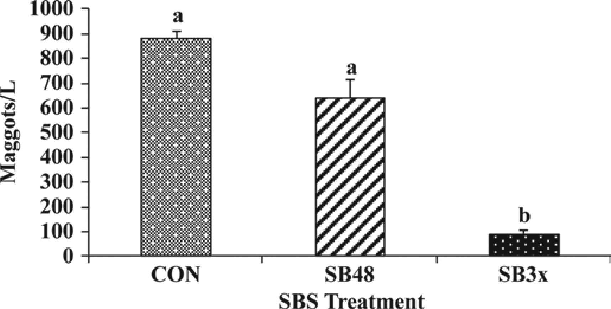

---
title: "Dairyconsult Meeting "
author: "Albart Coster"
date: "4-20-2026"
engine: knitr
format:
  revealjs:
    scrollable: true
lang: nl
output-dir: docs
bibliography: bib_albart.json
css: styles.css
--- 

```{r}
#| label: start
#| echo: false
#| results: 'hide'
#| warning: false
packages <- c("echarts4r",
              "openxlsx",
              "dplyr",
              "stringr",
              "gt")
installed_packages <- packages %in% rownames(installed.packages())
if (any(installed_packages == FALSE))
  install.packages(packages[!installed_packages])
invisible(lapply(packages, library, character.only = TRUE))
```


## Content

- Article the Bullvine; stocking density pre-fresh group
- Sodiumbisulfate; update
- Update on NH3 reduction
- SCC trends, see https://www.agproud.com/articles/62686-case-study-the-chronic-cow-driving-up-bulk-tank-scc
- Update of the productionapp


## Article on the Bullvine

See [article](https://www.thebullvine.com/news/548-pounds-of-milk-lost-in-a-crowded-dry-pen-inside-a-400%E2%80%91cow-holstein-herds-metabolic-prep-fix/)

- Transition cow management starts with low stocking density in transition barn
- Aim for 80% stocking density
- Effect of short day photoperiod on prolactin signaling in dry cows and subsequent production: see @alward2025
- Aim for low percentage of cows with high BHBA and NEFA


## Update on Sodiumbisulfate:

- Not only works against NH3 but also against flies! See @calvo2010



## NH3 reduction

- Acification of manure again in the news. 
- 50% of the ammonia is lost in the barn, 50% on the field.

Methods to reduce NH3 loss in the barn:

- Remove manure fast to storage
- Barn should be clean
- Drip water in the passages
- Don't ventilate the storage of the manure


## SCC

Pay attention to single cows. See this [article](https://www.agproud.com/articles/62686-case-study-the-chronic-cow-driving-up-bulk-tank-scc)


## Update on the productionapp

Now with possibility to follow a cohort of cows over time


## References

