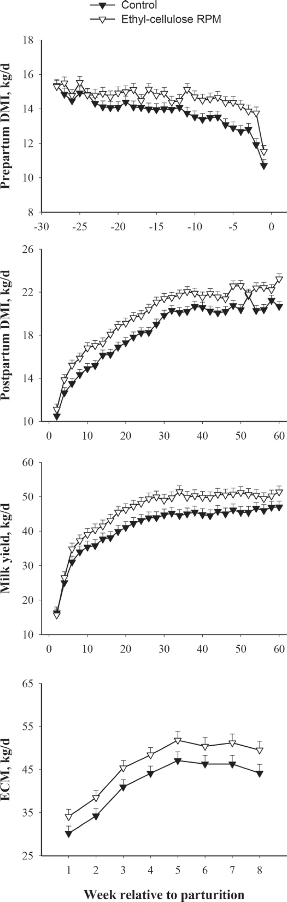
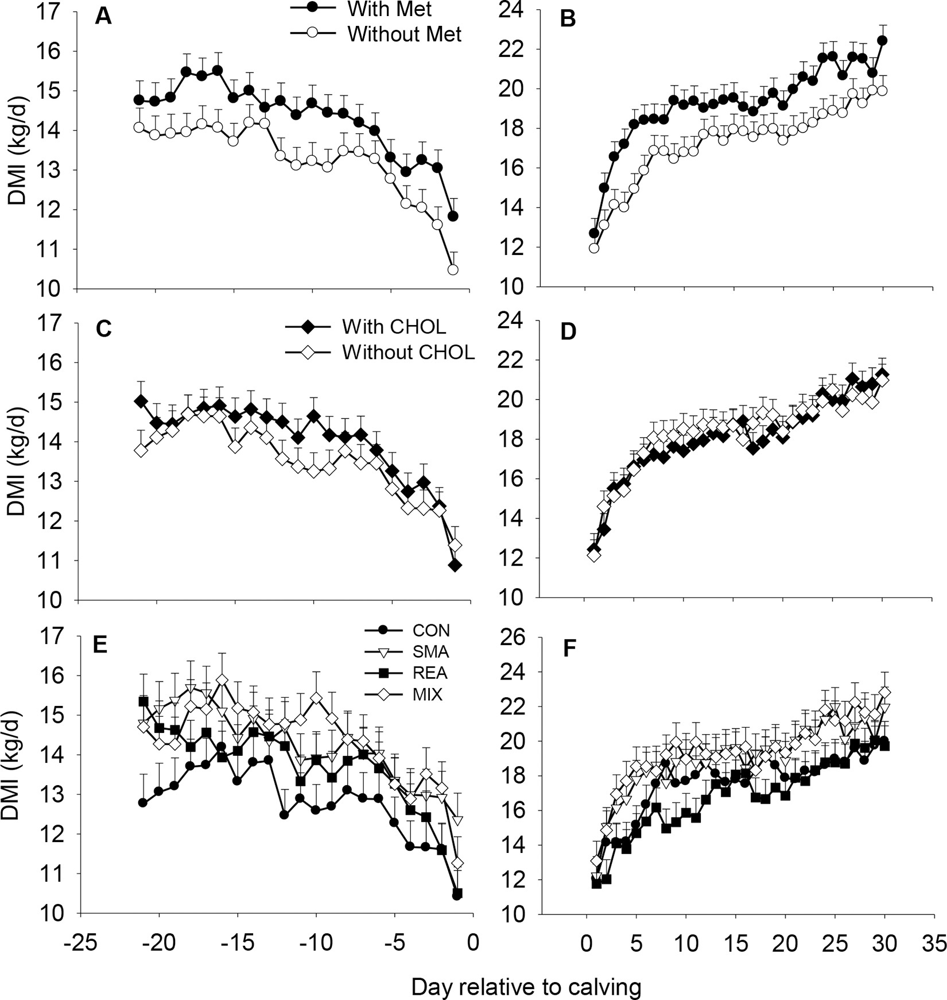
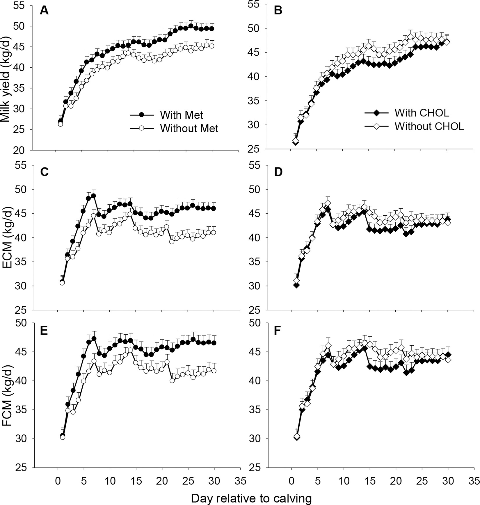
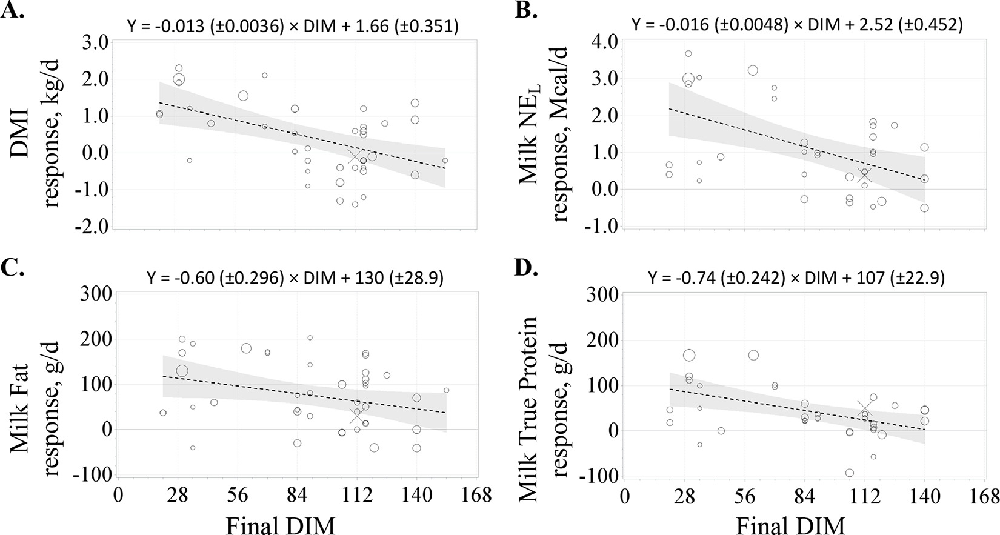
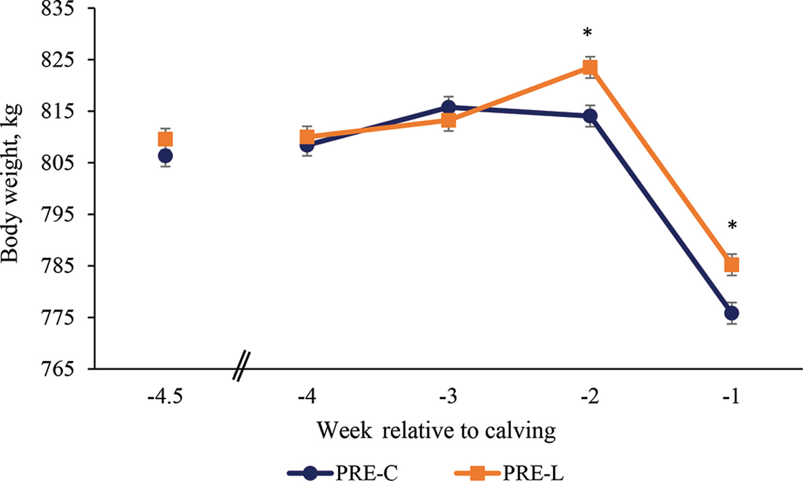
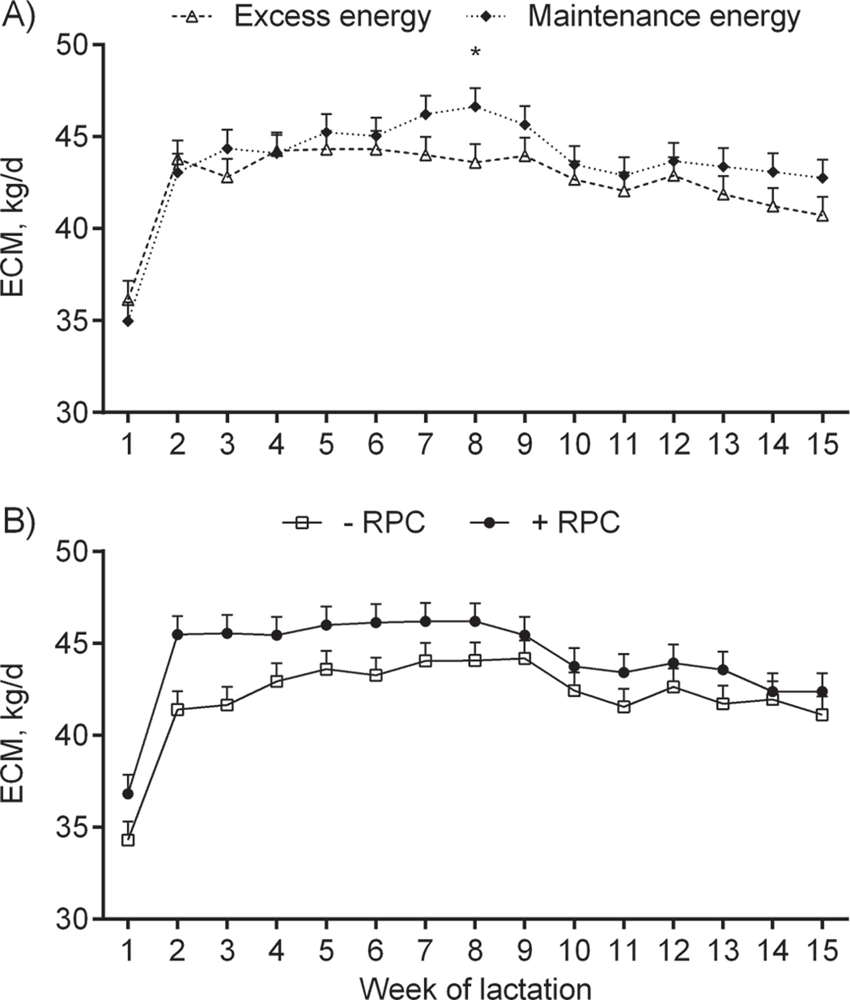
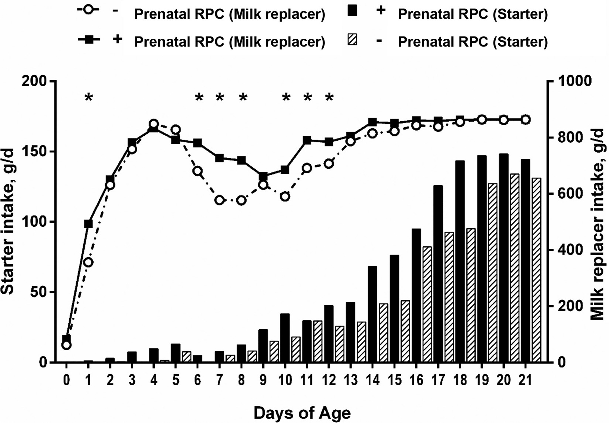

---
title: "Dairyconsult Meeting "
author: "Albart Coster"
date: "5-18-2026"
engine: knitr
format:
  revealjs:
    scrollable: true
lang: nl
output-dir: docs
bibliography: bib_albart.json
css: styles.css
--- 

```{r}
#| label: start
#| echo: false
#| results: 'hide'
#| warning: false
packages <- c("echarts4r",
              "openxlsx",
              "dplyr",
              "stringr",
              "gt")
installed_packages <- packages %in% rownames(installed.packages())
if (any(installed_packages == FALSE))
  install.packages(packages[!installed_packages])
invisible(lapply(packages, library, character.only = TRUE))
```


## Methionine pre- and postpartum:

- Rumen protected Methionine (Mepron): greater intake pre- and postpartum, greater milk production less diseases postpartum. @batistel2017:




- Rumen protected methionine (smartamine) compared with choline (reashure). With methionine better intake pre- and postpartum than with choline. With methionine more milk than with choline. With choline more higher Insulin and higher glucose in blood. And lower incidence of ketosis and retained placenta. @zhou2016a, @zhou2016b.





- rpMeth led to better neutrophil function. Neutrophil function important innate immunity; important for release of placenta. @osorio2013. 
- Better uterine health with methionine pre- and postpartum. @skenandore2017;
- Review of @zanton2024: methionin in transition phase increased milkproduction pp. Effects faded with DIM:




## Lysine pre- and postpartum

- rpLysine supplementation prepartum led to greater BW before calving, and greater DMI pre- and postpartum. And led to greater milk production postpartum. @fehlberg2020.



- rpLysine pre- and postpartum increased uterine health. @guadagnin2022. 
- No effects of supplementing with lysine. @lee2019. 

## Choline

- Choline feeding in ration balanced for methionine increased production and reduced hypocalcemia. Also, it reduced incidence of fatty liver. @zenobi2018. 



- Supplementation with rumen protected choline in prepartum phase. Offspring of supplemented cows grew faster, had less fever events, and better immunity. @zenobi2022 and @zenobi2018.



- Supplementation with choline improved immunity of cows postpartum, @zenobi2020
- Supplementation with choline in transition period let to less diseases in transition phase. @lima2012. 
- Increasing liver triacylglycerol leads to more diseases, @arshad2022. Intake of choline slighlty reduces liver TAG (@zenobi2018a).
- Review: feeding RPC increased production, and reduced risk for metritis, milk fever, displaced abomasum, ketosis and the concentration of liver TAG. @arshad2019. 

## Niacine

- Supplementing niacin increased milk production, but also to greater BHB and NEFA (@krogstad2025).
- In a review (@arshad2025): niacin did not improve performance in transition phase but increased production.
- Niacin led to lower NEFA in @morey2011.

## references


- Choline in transition, effect on calves: Zenobi


## References

