---
title: "Datadriven Dairy; perspectief nutritionist"
author: 
  - name: "Albart Coster"
    email: "albart@dairyconsult.nl"
date: "6-10-2026"
engine: knitr
format:
  revealjs:
    scrollable: true
lang: nl
output-dir: docs
bibliography: bib_albart.json
css: styles.css
--- 

```{r}
#| label: start
#| echo: false
#| results: 'hide'
#| warning: false
packages <- c("echarts4r",
              "openxlsx",
              "dplyr",
              "stringr",
              "ggplot2",
              "ggiraph",
              "gt")
installed_packages <- packages %in% rownames(installed.packages())
if (any(installed_packages == FALSE))
  install.packages(packages[!installed_packages])
invisible(lapply(packages, library, character.only = TRUE))
load("data_grafieken_20260609/20260609plots.Rdata")
```


## *Data-driven*

- *data-driven*; wat is het doel?
- *data-driven*; is dat nieuw en is dat AI?
- *data-driven*; waarom?
- *data-driven*: welke data?
- *data-driven*: wie drijft/stuurt aan?

## Krachtvoerverbruik en melkproductie

```{r}
#| fig-width: 10
#| fig-height: 5.5
#| out-width: "100%"
#| out-height: "100%"

girafe(
  ggobj = kvvplot,
  options = list(
    opts_sizing(rescale = TRUE, width = 1),
    opts_hover(css = "r: 5pt; stroke: #000; transition: all 0.2s ease-in-out;"),
    # Optioneel: Maak niet-geactiveerde groepen een beetje transparant
    opts_hover_inv(css = "opacity: 0.5;")
  )
)
```

## Waarom die verschillen in krachtvoergift

- Prijs en beschikbaarheid van ruwvoer
- Aandeel snijmais in een rantsoen
- Ruwvoerkwaliteit

## Waarom is ruwvoerkwaliteit zo belangrijk?

{width="60%"}

::: rf
Bron: @aschenbach2019
:::

```{r,echo=FALSE,results='asis'}
t1 <- data.frame(Kenmerk = c("LPS",
                             "Methylalanine",
                             "Putrescine",
                             "Cadaverine",
                             "Histamine"),
                 basis= c(14692,37.3,14,15.9,2.03),
                 Sara1 = c(131209,37.3,32.2,24.2,13),
                 Sara2 = c(168285,46,30.7,24.3,5.19))
gt(t1)
```

::: rf
Bron: @humer2018
:::


::: rf
Bron: @pieper2009
:::

## Hoe bereiken we goede ruwvoerkwaliteit?

- Snelheid van drogen
- Snelheid van conservering
- Voorkomen van verliezen bij uitkuilen

## Ruwvoerwinning. Snel drogen

```{r}
#| label: "tab-cavallarin"
#| echo: false
#| results: 'asis'


tabc <- read.xlsx("beelden/20251103_tabellen.xlsx",
                   sheet = "tab1cavallarin2005",
                   colNames = FALSE)

rc <- function(x){
  round(as.numeric(str_trim(gsub("[a-z]","",x))),2)
}

tabc |> 
  mutate(across(colnames(tabc)[-1],rc))|> 
  gt(id="three",rowname_col = "X1") |> 
  tab_stubhead(label = "Kenmerk") |> 
  tab_header(title = "Invloed kneuzen en drogen op kwaliteit Sainfoin.")|> 
  tab_spanner(label = "Ongekneusd",columns  = c(X3:X5)) |> 
  tab_spanner(label = "Gekneusd",columns  = c(X6:X8)) |> 
  cols_label(X2 = "0",
             X3 = "25",
             X4 = "71",
             X5 = "77",
             X6 = "5",
             X7 = "25",
             X8 = "29") |> 
  opt_css(
    css = "
    .cell-output-display {
      overflow-x: unset !important;
    }
    div#two {
      overflow-x: unset !important;
      overflow-y: unset !important;
    }
    #two .gt_col_heading {
      position: sticky !important;
      top: 0 !important;
    }
    ")
```

-   Snelheid van drogen bepaalt kwaliteitsverliezen
-   Snelheid belangrijker dan uiteindelijke DS-percentage

::: rf
Bron:  @Cavallarin2005
:::

## Snelheid van drogen wordt beïnvloed door

- Kneuzen
- schudden

```{r}
#| label: "tab-borreani" 
#| echo: false
#| results: 'asis'
#| 
tabsb <- read.xlsx("beelden/20251103_tabellen.xlsx",
                   sheet = "tabsborreani1999",
                   colNames = TRUE)

tabsb |> 
  select(-Trial) |> 
  gt(id="four",rowname_col = "Systeem") |> 
  tab_stubhead(label = "Kenmerk") |> 
  tab_header(title = "Invloed van kneuzen en schudden op droogsnelheid.") |> 
  tab_spanner(label = "Droogsnelheid",columns  = c(S1:S2)) |> 
  tab_spanner(label = "% van controle",columns  = c(perc1:perc2)) |> 
  cols_label(S1 = "Ongeschud",
             S2 = "Geschud",
             perc1 = "Ongeschud",
             perc2 = "Geschud") |> 
  tab_footnote("letters geven significante verschillen aan.")|> 
  tab_row_group(label = "Gras",rows= 1:12)|> 
  tab_row_group(label ="Luzerne",rows= 13:24) |> 
  opt_css(
    css = "
    .cell-output-display {
      overflow-x: unset !important;
    }
    div#two {
      overflow-x: unset !important;
      overflow-y: unset !important;
    }
    #two .gt_col_heading {
      position: sticky !important;
      top: 0 !important;
    }
    ")
```

::: rf
Bron: @Borreani1999
:::

## Moment van schudden maakt echter ook uit: {.nostretch}

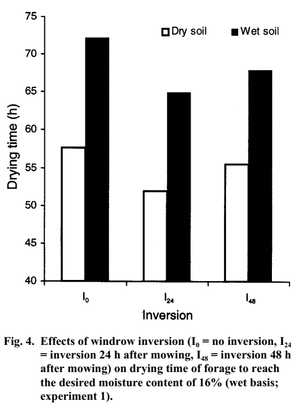{width=300}

::: rf
Bron: @Savoie2002
:::

En verder:

- Weersomstandigheden
- Ondergrond

## Ruwvoerwinning. Intermezzo: tijd van drogen en vitamine D

Vitamine D gehalte in gras neemt toe tijdens de veldperiode:

```{r}
#| labe: "tab-vitD"
#| echo: false
#| results: asis


tabnl <- read.xlsx("beelden/20251103_tabellen.xlsx",
                   sheet = "tab2newlander1952",
                   colNames = TRUE)

tabnl |> 
    select(-c(No,Gewas)) |> 
  gt(id="five") |> 
  tab_row_group("Spaanse Dravik en Luzerne, gemaaid 28/6/1950 7:00",
                rows = 1:4) |> 
  tab_row_group("2e S. Luzerne, gemaaid 15/8-1950 7:00",
                rows = 5:7) |> 
  tab_row_group("Spaanse Dravik, gemaaid 21-6-1951 13:30",
                rows = 8:10) |> 
  tab_row_group("Luzerne, gemaaid 21-6-1951 13:30",
                rows = 11:13) |> 
  tab_row_group("Spaanse Dravik, gemaaid 11-7-1951 11:00",
                rows = 14:16) |> 
  tab_header(title = "Invloed van tijd en weer op Vit D3 gehalte in grassen.") 
```

::: rf
Bron: @Newlander1952
:::

## Ruwvoerwinning. Snel conserveren

Verliezen gaan na het inkuilen door tot pH stabiel (laag) is. pH van kuil daalt als er melkzuur wordt gevormd. Dat wordt pas gevormd als zuurstof in kuil op is.

{width="90%"}


 

```{r,echo=FALSE,results='asis'}
tabd <- read.xlsx("beelden/20251103_tabellen.xlsx",
                   sheet = "tab2davies1998",
                   colNames = TRUE)
colnames(tabd) <- letters[1:4]

tabd |> 
  gt(id="six",rowname_col = "a") |> 
  tab_footnote("letters geven significante verschillen aan") |> 
  cols_label(b = "Onbehandeld",
             c = "Geïnoculeerd",
             d = "Aangezuurd")
```

::: rf
Bron: @Davies1998
:::

## Ruwvoerwinning: hakselen en aanrijden

```{r,echo=FALSE,results='asis'}
tabp <- read.xlsx("beelden/20251103_tabellen.xlsx",
                   sheet = "tab3pauly1999",
                   colNames = TRUE)
colnames(tabp) <- letters[1:ncol(tabp)]

tabp |>
  select(-1)|> 
  gt(id="seven") |> 
  ##tab_header("Invloed van techniek en aanrijden op silagekwaliteit.")|> 
  cols_label(b = "Dichtheid",
              c= html("Melkzuur<br>(g/kg)"),
                    d = "pH",
                    e = html("NH3<br>(g/kg N)"),
                    f = html("Boterzuur<br>(g/kg)"),
                    g = html("Ethanol<br>(g/kg)"),
                    h = html("Clostridium Sporen<br>(log KVE/g)"))|> 
  tab_row_group("FW 26 cm",rows = 1:2) |> 
  tab_row_group("FW 4 cm",rows = 3:4) |> 
  tab_row_group("PC 4 cm",rows = 5:6)
```

::: rf
Bron: @Pauly1999
:::

## Ruwvoerwinning: afdekken {.nostretch}


```{r,echo=FALSE,results='asis'}
tabl1 <- read.xlsx("beelden/20251103_tabellen.xlsx",
                   sheet = "tab1lima2017",
                   colNames = TRUE)

tabl1 |>
  gt(id="eight",rowname_col = "Item") |> 
    tab_header("Eigenschappen van folie in onderzoek.")


tabl3 <- read.xlsx("beelden/20251103_tabellen.xlsx",
                   sheet = "tab3lima2017",
                   colNames = TRUE) 

tabl3 |> gt(id = "nine",rowname_col = 'item') |> 
  tab_header("Microbiële en fermentatieeigenschappen van kuilen.")

tabl4 <- read.xlsx("beelden/20251103_tabellen.xlsx",
                   sheet = "tab4lima2017",
                   colNames = TRUE)

tabl4 |> gt(id = "ten",rowname_col = 'item') |> 
  tab_header("Voederwaarde op verschillende plekken in kuilen.") 
```

::: rf
Bron: @Lima2017
:::

## Ruwvoerwinning: inkuilmiddel

 

```{r,echo=FALSE,results='asis'}
tablk <- read.xlsx("beelden/20251103_tabellen.xlsx",
                   sheet = "tab2kristensen2010",
                   colNames = FALSE)

tablk |>
  mutate(across(colnames(tablk)[-1],rc)) |> 
  gt(id="eleven",rowname_col = "X1") |> 
  tab_header("Eigenschappen van kuilen ingekuild met drie verschillende inkuilmiddelen over de tijd.") |> 
  tab_spanner(label = "January",columns  = c(X2:X4)) |> 
  tab_spanner(label = "April",columns  = c(X5:X7)) |> 
  tab_spanner(label = "August",columns  = c(X8:X10)) |>
  sub_missing(columns = everything(),missing_text = "") |> 
  cols_label(X2 = "Control",
             X3 = "Lactsil",
             X4 = "Lactisil Fresh",
             X5 = "Control",
             X6 = "Lactsil",
             X7 = "Lactisil Fresh",
             X8 = "Control",
             X9 = "Lactsil",
             X10 = "Lactisil Fresh") |> 
  opt_css(
    css = "
    .cell-output-display {
      overflow-x: unset !important;
    }
    div#eleven {
      overflow-x: unset !important;
      overflow-y: unset !important;
    }
    #eleven .gt_col_heading {
      position: sticky !important;
      top: 0 !important;
    }
    ")
```

::: rf
Bron: @Davies1998,@Kristensen2010
:::

-   Voor behoud van eiwitkwaliteit: homofermentative middelen
-   Voor aerobe stabiliteit: mengsel van homo- en heterofermentatieve middelen

## Ruwvoerwinning: Inkuilen onder (zeer) moeilijke omstandigheden

```{r}
#|echo: FALSE
#|results: 'asis'
#|warning: FALSE


tabpiep <- read.xlsx("beelden/20251103_tabellen.xlsx",
                   sheet = "table1pieper2009",
                   colNames =TRUE)

rc <- function(x){
  round(as.numeric(str_trim(gsub("[a-z]","",x))),2)
}

tabpiep |>
  select(-2) |> 
  mutate(across(colnames(tabpiep)[-(1:2)],rc)) |> 
  gt(id="twelve",rowname_col = "Feedstuff") |> 
  tab_header("Eigenschappen van uitgangsmateriaal.")
```

{width="80%"}

::: rf
Bron: @pieper2009
:::

hier filmpjes van gras + maismengsel --  --  --  -- 

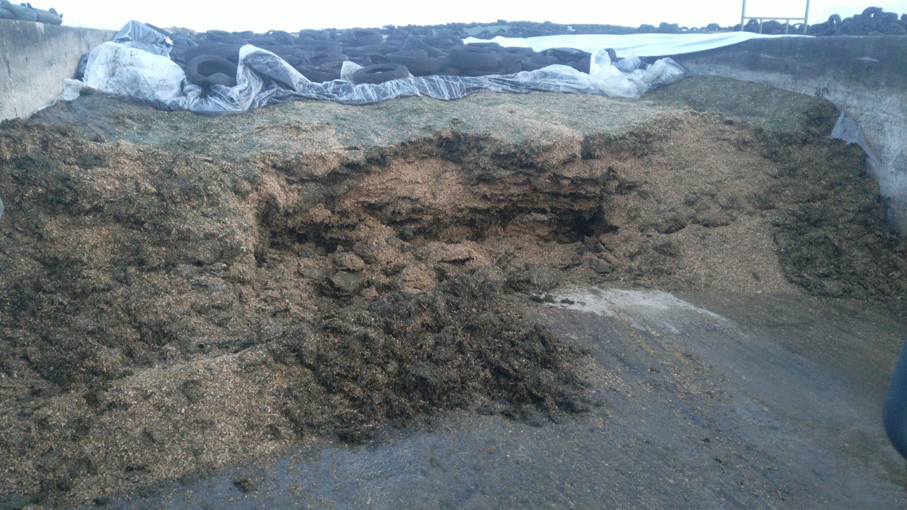
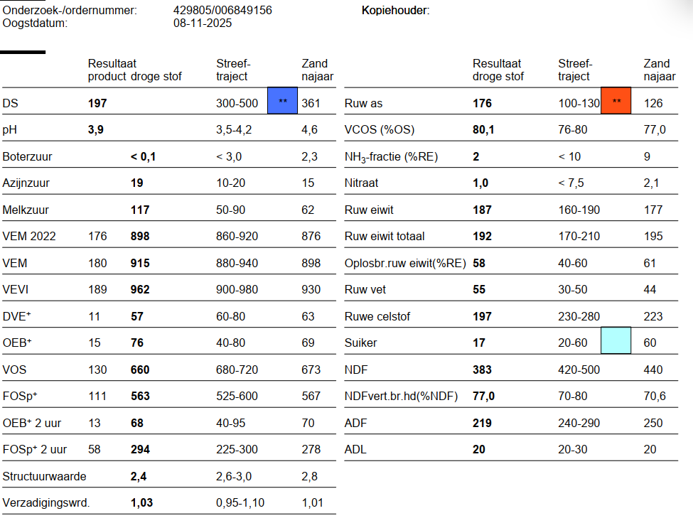


## Ruwvoerwinning: Intermezzo: eiwitafbraak en rode klaver

Rode klaver bevat een enzym dat proteolyse remt:

```{r,echo=FALSE,results='asis'}
tabli <- read.xlsx("beelden/20251103_tabellen.xlsx",
                   sheet = "tab2li2018",
                   colNames =TRUE)
 

tabli |> 
  filter(!is.na(R0)) |> 
  mutate(across(colnames(tabli)[-(1)],rc)) |> 
  gt(id="thirteen",rowname_col = "Item") |> 
  tab_header("Invloed van toenemend aandeel rode klaver in luzernekuil.")
```

::: rf
Bron: @Li2018
:::

## Ruwvoerwinning: Samenvatting

-   Snelheid van drogen
-   Snelheid van conserveren

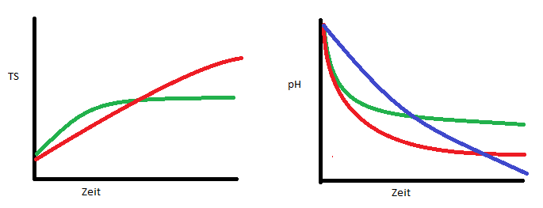

## Data-driven en gehaltes in de melk

[Link naar dashboard](https://dashboard.costeranalytics.nl/dashboard_productie_rhino/)

## Gehaltes in melk

- Seizoenseffecten

::: {#fig-salfer layout-ncol=2}

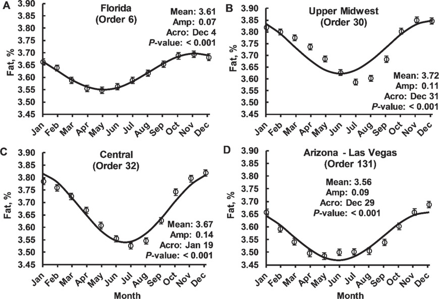

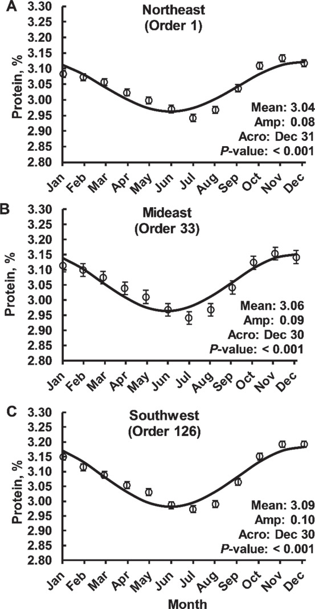

Studie Salter
:::

::: rf
Bron: @salfer2019
:::

- Rantsoeneffecten; trans-vetzuren

::: {#fig-transfat layout-ncol=2}

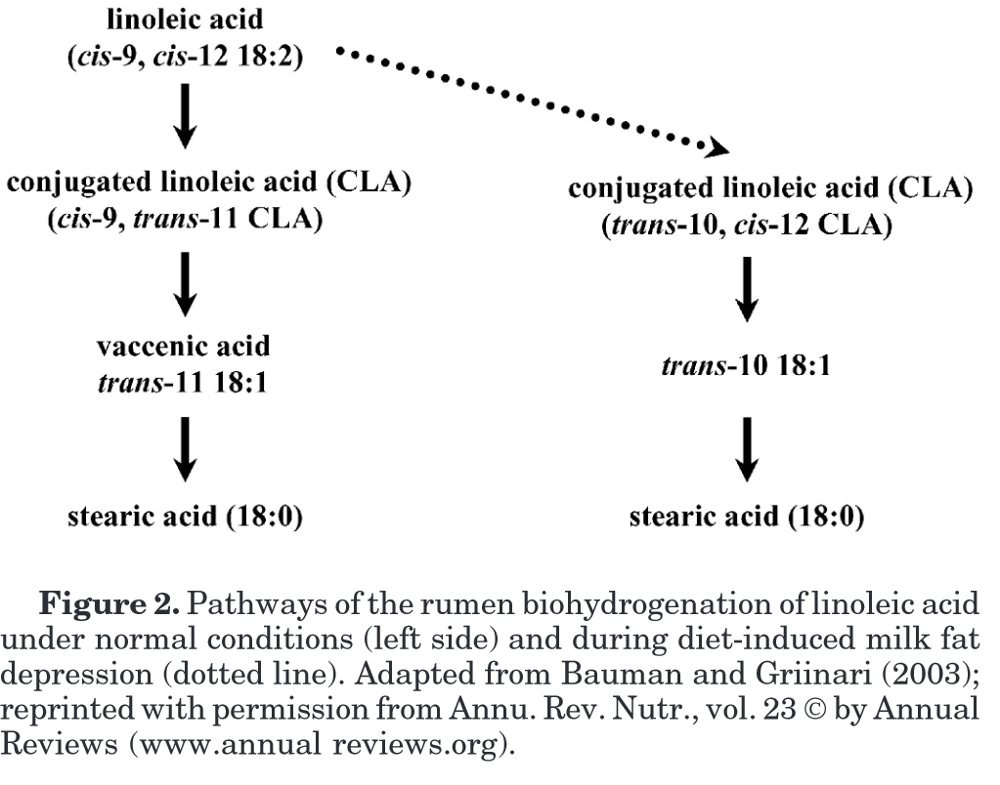

```{r}
#| label: "tab-baumgard"
#| echo: false
#| results: 'asis'


tabbg <- read.xlsx("beelden/20251103_tabellen.xlsx",
                   sheet = "tab3_baumgard_2001",
                   colNames = TRUE) |> 
  gt(id = "baumgard",rowname_col = "item") |> 
  tab_spanner(label = "Dosering CLA, C18:1 t10-c12",columns = 2:5)
tabbg
```

Studies CLA

:::

::: rf
Bronnen: @baumgard2001,@bauman2006
:::

## Gehaltes: toevoegingen

- Palmitinezuur: verhoogt melkvet maar vermindert insulinesensitiviteit (@rico2016)

::: {#fig-palmitinezuur layout-ncol=2}

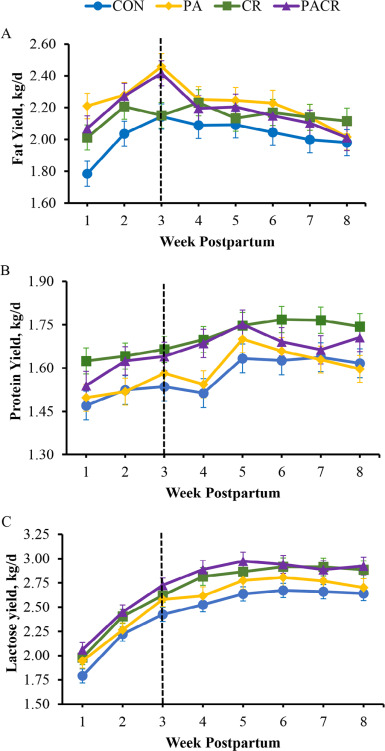

```{r}
#| label: "tab-parales"
#| echo: false
#| results: 'asis'

tabpa <- read.xlsx("beelden/20251103_tabellen.xlsx",
                   sheet = "tab_3_parales_2025",
                   colNames = TRUE) |> 
  dplyr::rename("C16:0+Chr." = 5) |> 
  gt(id = "baumgard",rowname_col = "item") |> 
  tab_spanner(label = "Behandeling",columns = 2:5) 


tabpa

```

Effecten van palmitinezuur en chroom op insulinehuishouding

:::


::: rf
Bronnen: @rico2016, @parales-giron2025
:::

- Oliezuur: verbetert verteerbaarheid van vet, verbetert conditie

::: {#fig-oliezuur layout-ncol=2}


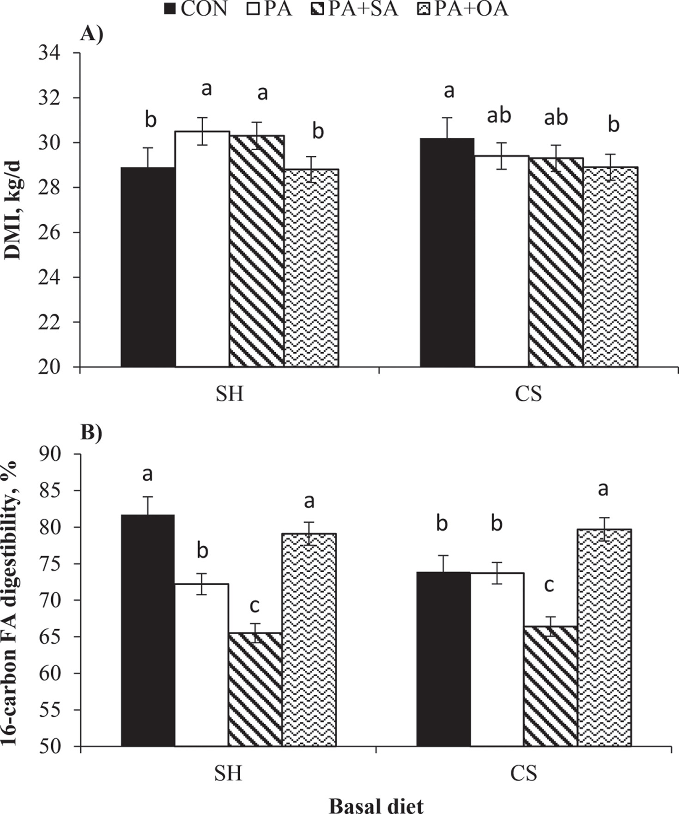{width=70%}


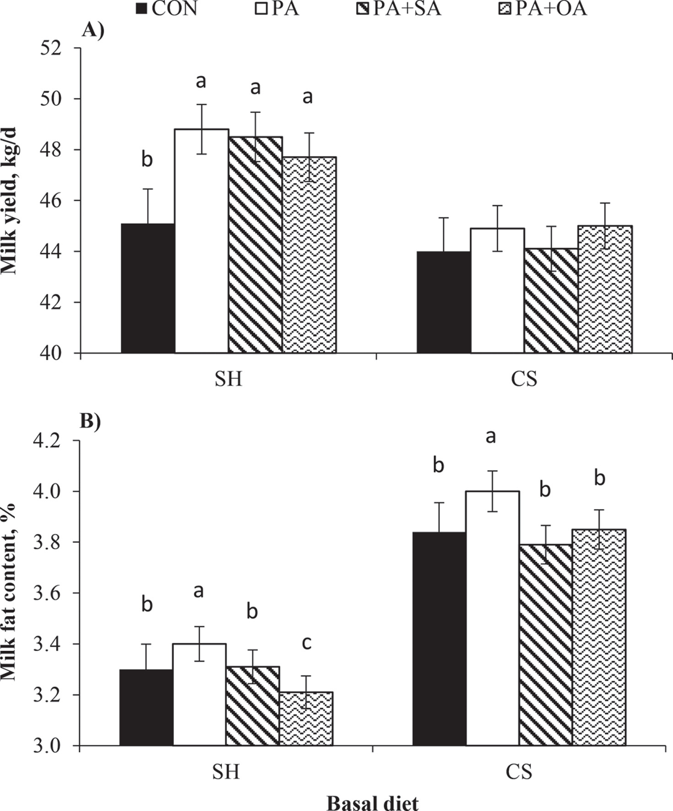{width=70%}

Invloed van oliezuur op productie en gehaltes.

:::


::: rf
Bron: @deSouza2018a
:::


- Omega 3 en omega-6 vetzuren. Invloed op gezondheid, ook op opname (zie oa @petit1992,)

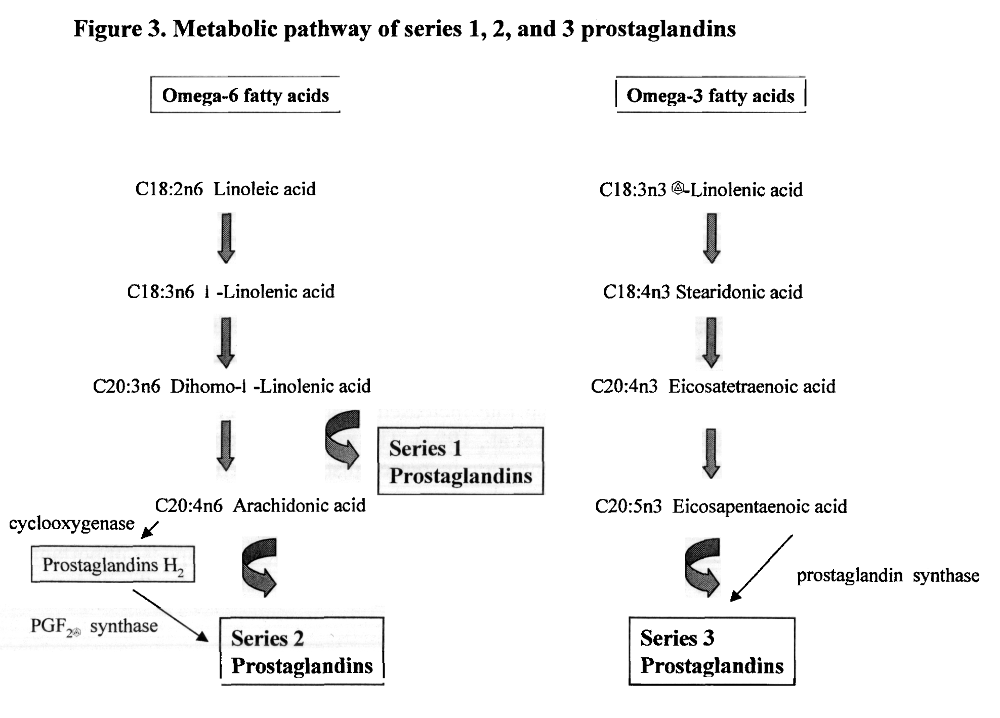


## Data driven en sensortechnieken

```{r}
#| fig-width: 10
#| fig-height: 5.5
#| out-width: "100%"
#| out-height: "100%"

girafe(
  ggobj = combined_plot,
  options = list(
    opts_sizing(rescale = TRUE, width = 1),
    opts_hover(css = "r: 5pt; stroke: #000; transition: all 0.2s ease-in-out;"),
    # Optioneel: Maak niet-geactiveerde groepen een beetje transparant
    opts_hover_inv(css = "opacity: 0.5;")
  )
)
```


## Reeds lang bekend:

::: {#fig-bertoni layout-ncol=2}

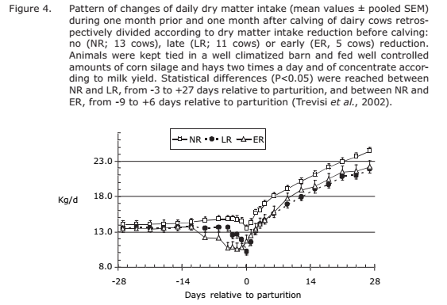

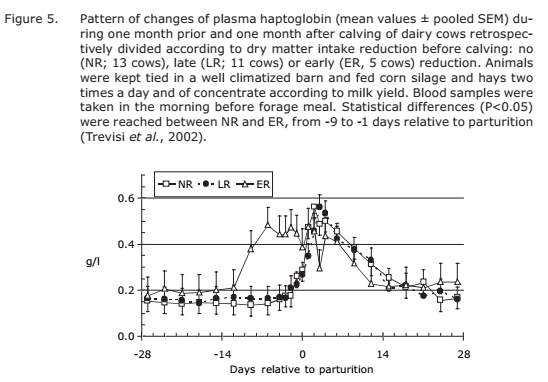

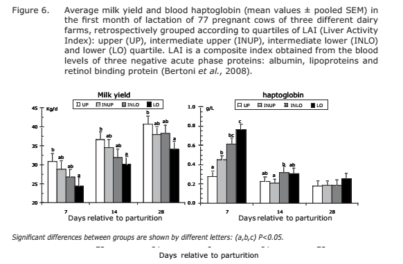

Studie Bertoni
:::

::: rf
Bron: @bertoni2010
:::


## Maatregelen

- Voorkomen van stress voor en rondom afkalven
- Optimale voederopname rondom afkalven

*Enkele punten*

- Aminozuurvoeding in transitie
- Eventueel inzet van bestendige choline in transitiefase
- Omstandigheden; voorkomen van hittestress

## Inzet van (pensbestendige methioninne)

Metaanalyse van @zanton2024: effecten van methione nemen af met laktatiedagen:


Met bestendige methionine (mepron): hogere opname voor en na afkalven, hogere melkproductie na afklaven, minder ziektes na afkalven @batistel2017:


Vergeleken met bestendige choline (reashure) gaf bestendige methionine (smartamine) hogere opname in transitie en hogere melkproductie na afkalven. Choline gaf weer hogere bloedglucose- en insulinewaardes na afkalven en iets minder ziektes, @zhou2016a, @zhou2016b.


Bestendige methionine gaf betere neutrofiel funktie @osorio2013. 

Bestendige methionine gaf betere baarmoedergezondheid @skenandore2017

## Inzet van bestendige lysine {.nostretch}

Inzet van bestendige lysine prepartum gaf hogere BW voor en na afkalven. En hogere productie na afkalven, @fehlberg2020.


Bestendige lysine gaf betere baarmoedergezondheid @guadagnin2022. 

In sommige studies geen effect, @lee2019. 


## Inzet van bestendige choline {.nostretch}

Inzet van choline in rantsoen dat al uitgebalanceerd was voor methionine (2.5% van DVE) gaf minder ziektes en meer melk na afkalven en minder leververvetting (@zenobi2018), onafhankelijk van energiegehalte van droogstandrantsoen:


Supplementatie met choline prepartum gaf gezondere kalverend die meer vraten en harder groeiden  (@zenobi2022 en @zenobi2018).


## Voorkomen van (hitte)stress in voorbereiding

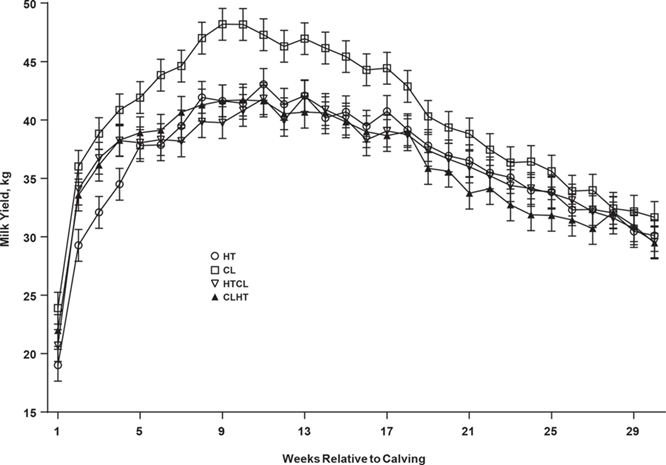


::: rf
Bron: @fabris2018
:::


## Eigen aanpak

- Proberen zonder anionische zouten te werken; eenvoudiger, mogelijkheid om meer gras te voeren
- Inzet van mengkuilen is vaak een erg goede oplossing
- Vaak goede ervaringen met calciumbinder

*uitdagingen*

- Meer gebruik maken van technieken
- Data uit systemen nuttig verzamelen en gebruiken
- Meer nadruk leggen op belang van stressvrij
- Soms; voorkomem van hoge NEFA's

## Data en uiergezondheid

```{r}
#| fig-width: 10
#| fig-height: 5.5
#| out-width: "100%"
#| out-height: "100%"

girafe(
  ggobj = combined_plot_c,
  options = list(
    opts_sizing(rescale = TRUE, width = 1),
    opts_hover(css = "r: 5pt; stroke: #000; transition: all 0.2s ease-in-out;"),
    # Optioneel: Maak niet-geactiveerde groepen een beetje transparant
    opts_hover_inv(css = "opacity: 0.5;")
  )
)
```

## Uiergezondheid en bewustwording

::: {style="width: 100%; overflow: auto; resize: both; border: 1px solid #ccc; padding: 10px;"}
```{r}
#| message: false
#| echo: false
library(dplyr)
library(gt)

tabcells
```
:::

## Maatregelen

Zorg voor schone ligboxen

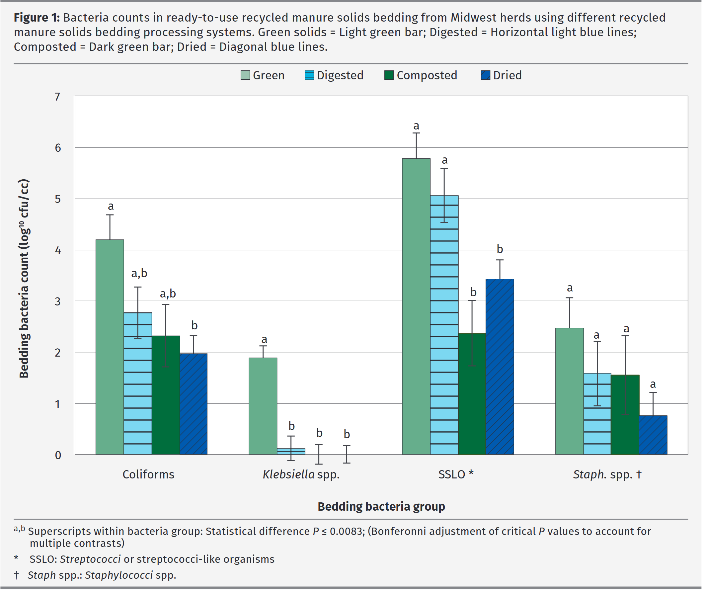
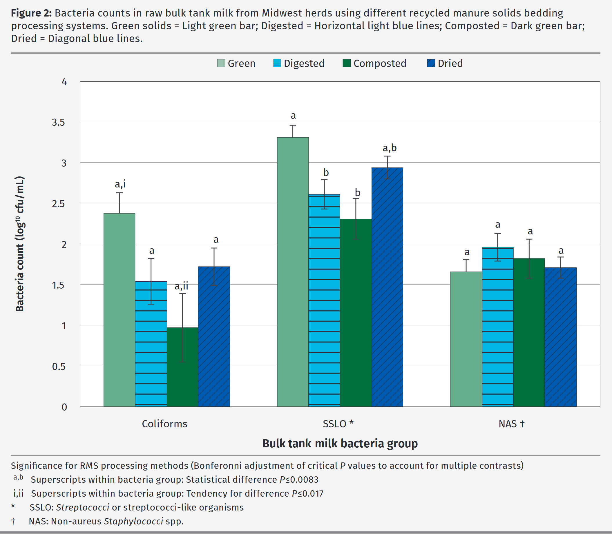

```{r}
#| message: false
#| echo: false

tgodden <- read.xlsx("beelden/20251103_tabellen.xlsx",
                   sheet = "tab1godden2024",
                   colNames = TRUE) |> 
  gt(id = 'tgodden',rowname_col = "Item") |> 
  sub_missing(columns =everything(),missing_text = "--") 
tgodden
```

::: rf
Bron: @godden2024
:::

## Maatregelen verder

- Melk droge spenen

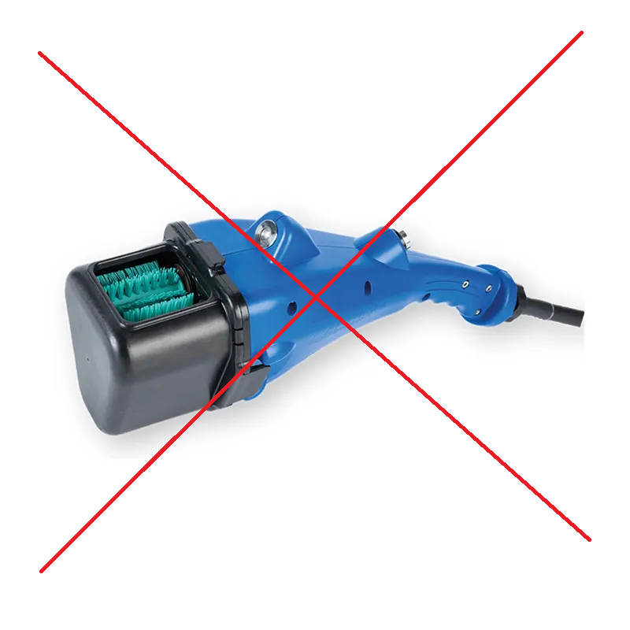

- Controleer dieren
- Let op hygiëne in transitiebereik. Vooral met stro
- Zorg voor schone kuilen en schoon voer. Zie punt LPS uit kuilen

## Data en opfok

```{r}
#| fig-width: 10
#| fig-height: 5.5
#| out-width: "100%"
#| out-height: "100%"

girafe(
  ggobj = combined_plot_w,
  options = list(
    opts_sizing(rescale = TRUE, width = 1),
    opts_hover(css = "r: 5pt; stroke: #000; transition: all 0.2s ease-in-out;"),
    # Optioneel: Maak niet-geactiveerde groepen een beetje transparant
    opts_hover_inv(css = "opacity: 0.5;")
  )
)
```

## Maatregelen

- Voorkom longontsteking bij kalveren. 

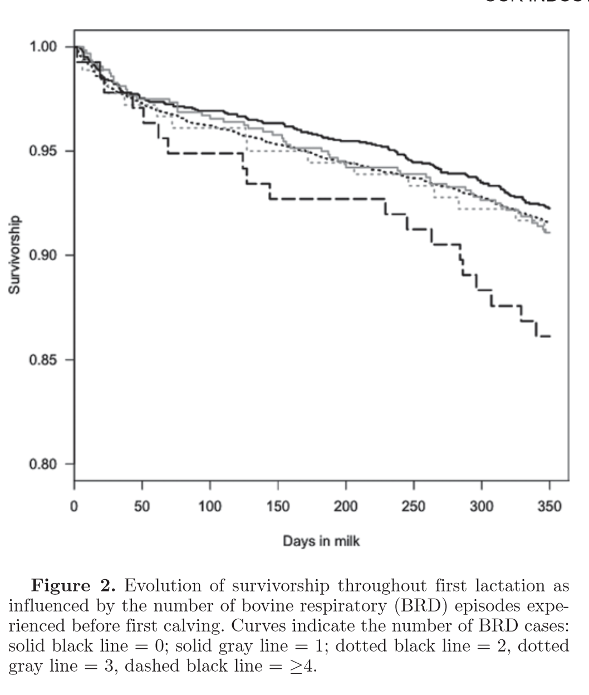{width=90%}

::: rf
Bron: @bach2011
:::


Let ook op [NH$_3$], zie [Podcast The Bullvine](https://www.thebullvine.com/news/dr-brays-5-sodium-bisulfate-gamble-zero-lung-lesions-and-the-real-cost-of-calf-barn-ammonia/)


::: {#fig-ammoniak layout-ncol=2}

 


Ammoniak in de stal meten
:::


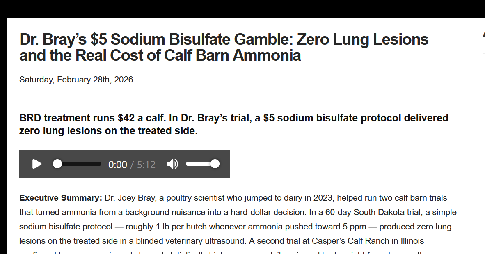


- Voer voldoende
- Meet gewicht!!!

## Verwijzingen


