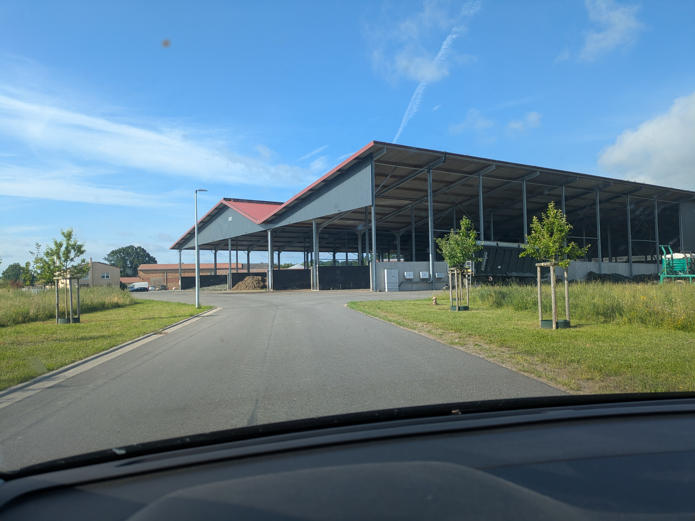
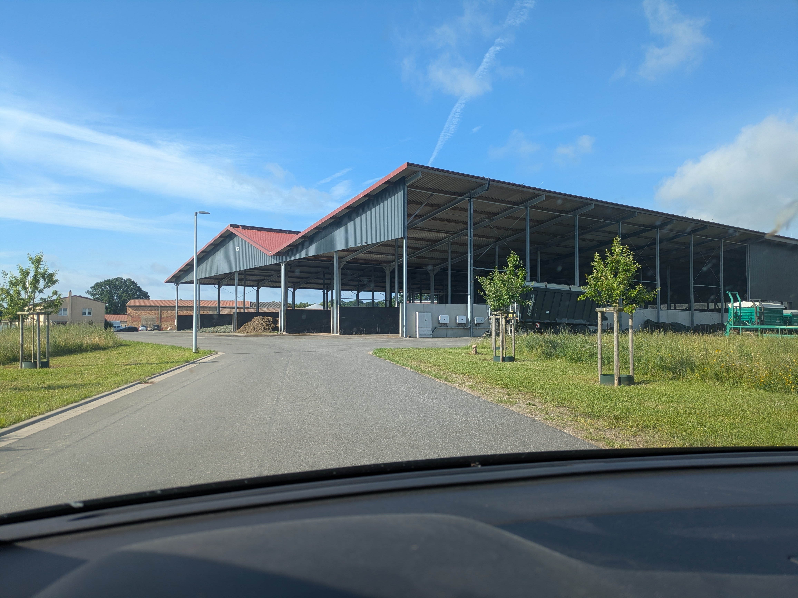
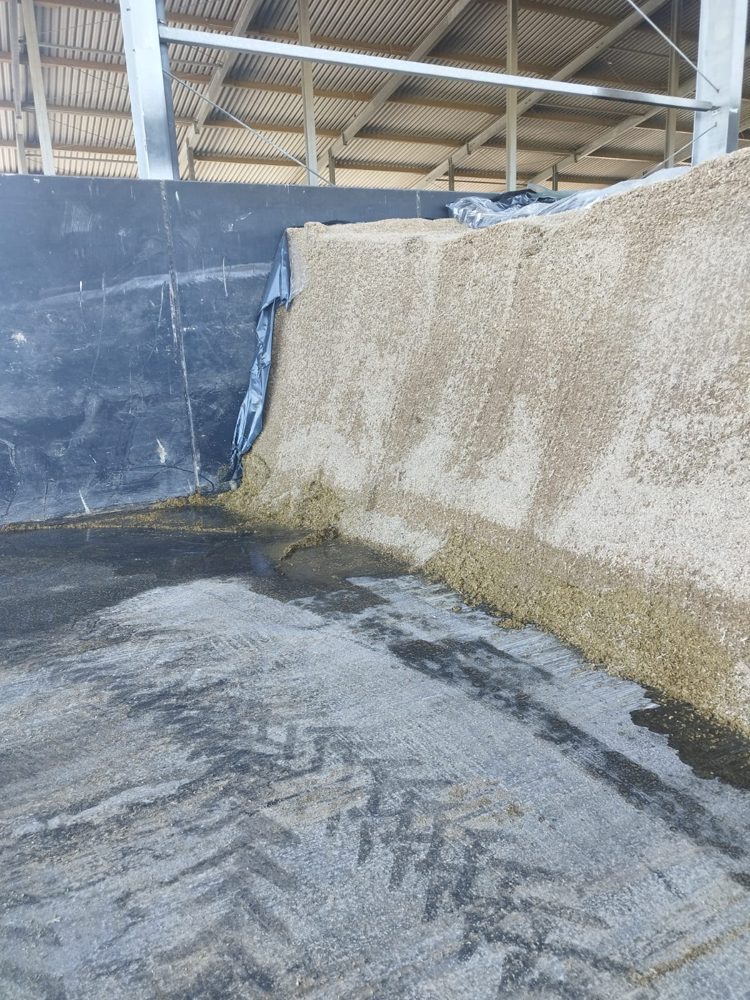
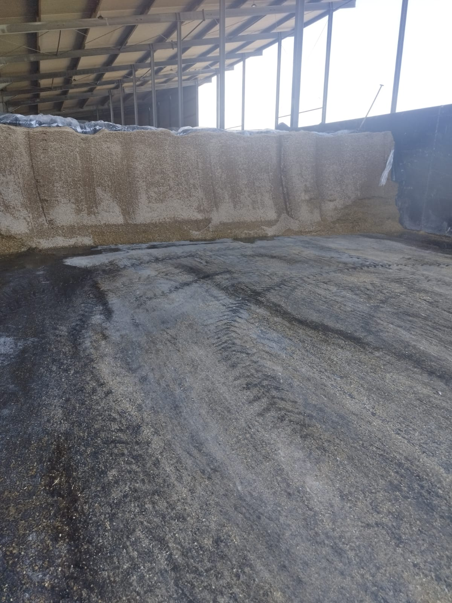
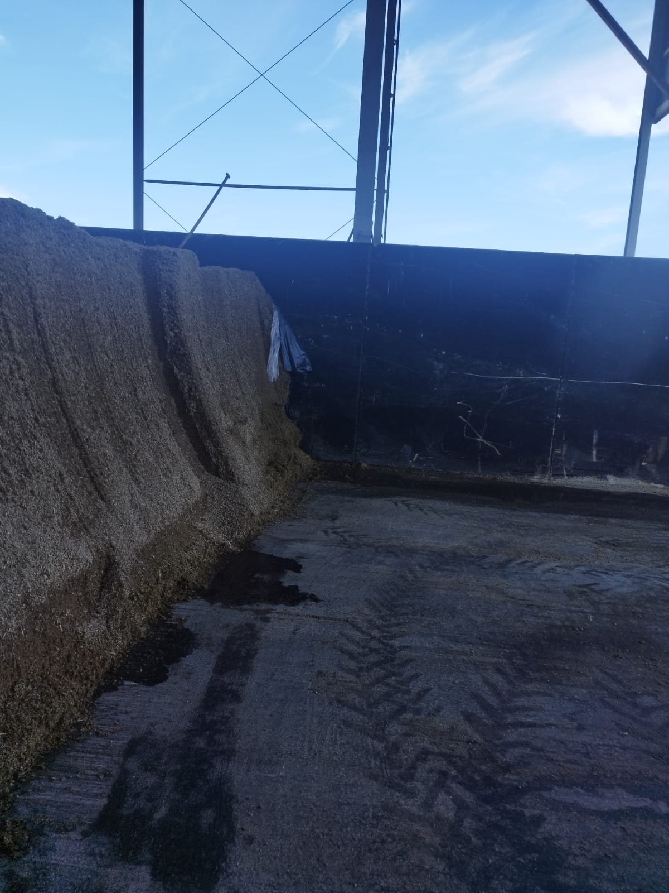
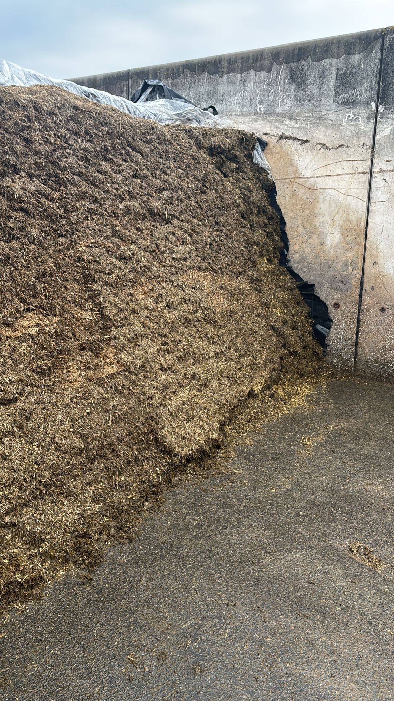
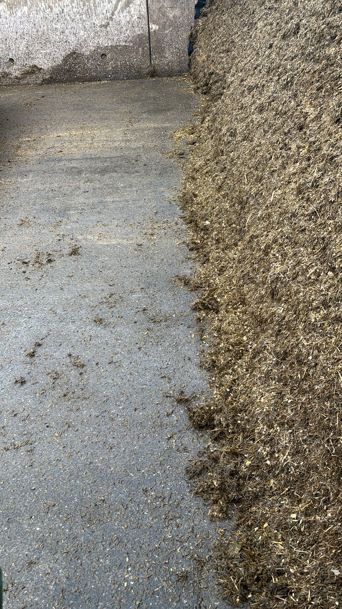
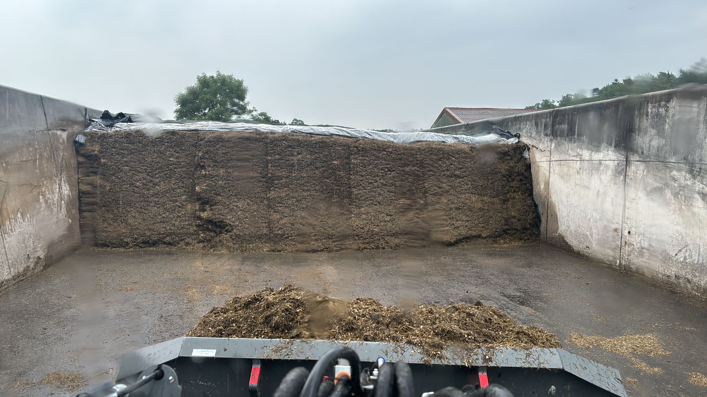

---
title: "Meeting Dairyconsult"
author: 
  - name: "Albart Coster"
    email: "albart@dairyconsult.nl"
date: "6-22-2026"
engine: knitr
format:
  revealjs:
    scrollable: true
filters:
  - carousel
lang: nl
output-dir: docs
bibliography: bib_albart.json
css: styles.css
--- 

```{r}
#| label: start
#| echo: false
#| results: 'hide'
#| warning: false
packages <- c("echarts4r",
              "openxlsx",
              "dplyr",
              "stringr",
              "ggplot2",
              "ggiraph",
              "gt")
installed_packages <- packages %in% rownames(installed.packages())
if (any(installed_packages == FALSE))
  install.packages(packages[!installed_packages])
invisible(lapply(packages, library, character.only = TRUE))
load("data_grafieken_20260609/20260609plots.Rdata")
```

## Measuring calf growth

```{r}
#| fig-width: 10
#| fig-height: 5.5
#| out-width: "100%"
#| out-height: "100%"

girafe(
  ggobj = combined_plot_w,
  options = list(
    opts_sizing(rescale = TRUE, width = 1),
    opts_hover(css = "r: 5pt; stroke: #000; transition: all 0.2s ease-in-out;"),
    # Optioneel: Maak niet-geactiveerde groepen een beetje transparant
    opts_hover_inv(css = "opacity: 0.5;")
  )
)
```

## Sensordata

```{r}
#| fig-width: 10
#| fig-height: 5.5
#| out-width: "100%"
#| out-height: "100%"

girafe(
  ggobj = combined_plot,
  options = list(
    opts_sizing(rescale = TRUE, width = 1),
    opts_hover(css = "r: 5pt; stroke: #000; transition: all 0.2s ease-in-out;"),
    # Optioneel: Maak niet-geactiveerde groepen een beetje transparant
    opts_hover_inv(css = "opacity: 0.5;")
  )
)
```

## Mixture of bewital

```{=html}
<iframe src="beelden/beelden_20260622/BEWI_FATRIX_MC 206_DE.pdf" width="100%" height="600px"></iframe>
```


## Cleanness of Silos {.nostretch} 

Bruel

::: {.fragment}
{width="60%"}
:::

::: {.fragment}
{width="60%"}
:::

::: {.fragment}
{width="60%"}
:::

{width="60%"}

Before cleaning

{width="60%"}
{width="60%"}
{width="60%"}
{width="60%"}
{width="60%"}
{width="60%"}
{width="60%"}
{width="60%"}
{width="60%"}
{width="60%"}


Bruel after

{width="60%"}
{width="60%"}
{width="60%"}
{width="60%"}
{width="60%"}

Kaarz after

{width="60%"}
{width="60%"}
{width="60%"}
{width="60%"}

## Some science, covering silage {.nostretch}


```{r,echo=FALSE,results='asis'}
tabl1 <- read.xlsx("beelden/20251103_tabellen.xlsx",
                   sheet = "tab1lima2017",
                   colNames = TRUE)

tabl1 |>
  gt(id="eight",rowname_col = "Item") |> 
    tab_header("Characteristics silage cover")


tabl3 <- read.xlsx("beelden/20251103_tabellen.xlsx",
                   sheet = "tab3lima2017",
                   colNames = TRUE) 

tabl3 |> gt(id = "nine",rowname_col = 'item') |> 
  tab_header("Microbial characteristics and fermentation of the silage.")

tabl4 <- read.xlsx("beelden/20251103_tabellen.xlsx",
                   sheet = "tab4lima2017",
                   colNames = TRUE)

tabl4 |> gt(id = "ten",rowname_col = 'item') |> 
  tab_header("Quality of the silage.") 
```

::: rf
Bron: @Lima2017
:::


## Verwijzingen


