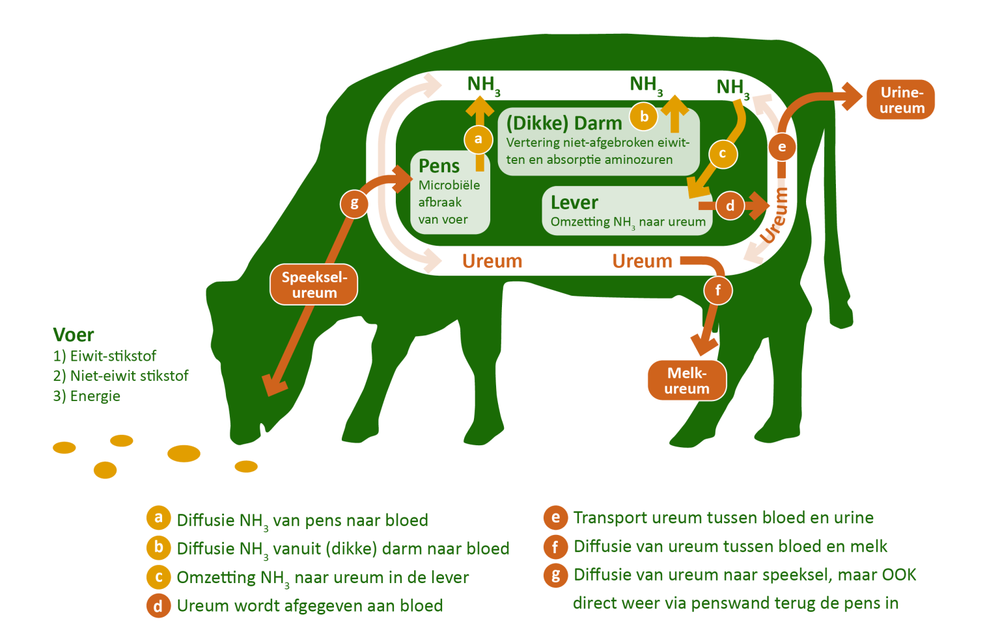
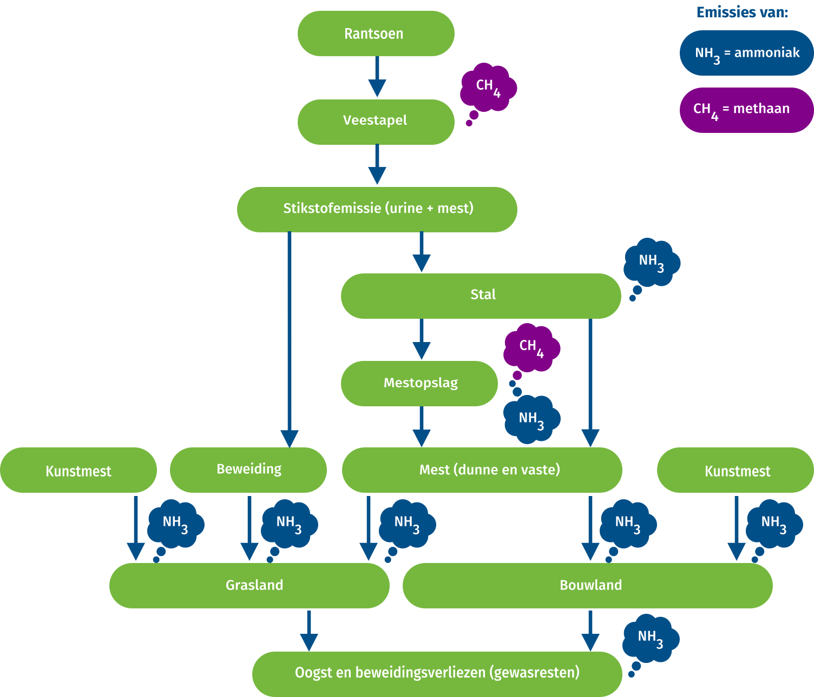
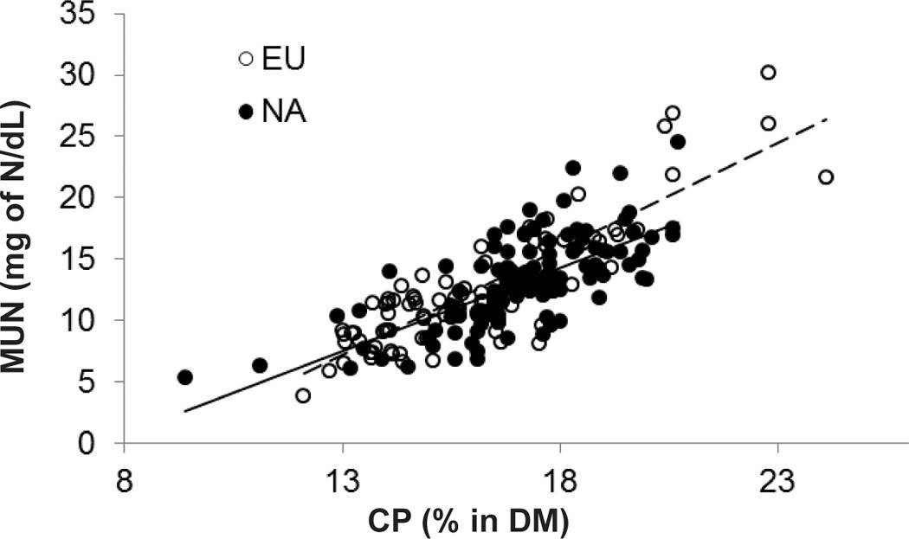
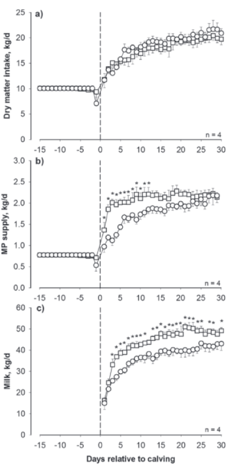

---
title: "Sessie ureum en eiwit in rantsoenen"
author: 
  - name: "Albart Coster"
    email: "albart@dairyconsult.nl"
date: "6-30-2026"
engine: knitr
format:
  revealjs:
    scrollable: true
lang: nl
output-dir: docs
bibliography: bib_albart.json
css: styles.css
--- 

```{r}
#| label: start
#| echo: false
#| results: 'hide'
#| warning: false
packages <- c("echarts4r",
              "openxlsx",
              "dplyr",
              "stringr",
              "ggplot2",
              "ggiraph",
              "gt")
installed_packages <- packages %in% rownames(installed.packages())
if (any(installed_packages == FALSE))
  install.packages(packages[!installed_packages])
invisible(lapply(packages, library, character.only = TRUE))
load("data_grafieken_20260630/20260630plots.Rdata")
```


## Zicht op ureum en ruw eiwit

- Ureummonitor; zicht op verloop ureum in melk vergeleken met collegaveehouders

```{r}
#| fig-width: 10
#| fig-height: 5.5
#| out-width: "100%"
#| out-height: "100%"

girafe(
  ggobj = uplot,
  options = list(
    opts_sizing(rescale = TRUE, width = 1),
    opts_hover(css = "r: 5pt; stroke: #000; transition: all 0.2s ease-in-out;"),
    # Optioneel: Maak niet-geactiveerde groepen een beetje transparant
    opts_hover_inv(css = "opacity: 0.5;")
  )
)
```

## Waarom is ureum belangrijk {.nostretch}

Schema eiwitvertering in rund:

{width="80%"}

::: rf
Bron: [Koe en eiwit](https://koeeneiwit.nl/nieuws/melkureum-wat-kun-je-er-mee-op-weg-naar-155re/)
:::

Schema NH3 (en CH4) emissies

{width="80%"}

::: rf
Bron: [Integraal aanpakken](https://integraalaanpakken.nl/ammoniak)
:::

## Wat bepaalt ureum in de melk?

{width="80%"}

::: rf
Bron: @spek2013
:::

## Wat bepaalt ureum in de melk?

```{r}
#| fig-width: 10
#| fig-height: 5.5
#| out-width: "100%"
#| out-height: "100%"

girafe(
  ggobj = replot,
  options = list(
    opts_sizing(rescale = TRUE, width = 1),
    opts_hover(css = "r: 5pt; stroke: #000; transition: all 0.2s ease-in-out;"),
    # Optioneel: Maak niet-geactiveerde groepen een beetje transparant
    opts_hover_inv(css = "opacity: 0.5;")
  )
)

girafe(
  ggobj = reurplot,
  options = list(
    opts_sizing(rescale = TRUE, width = 1),
    opts_hover(css = "r: 5pt; stroke: #000; transition: all 0.2s ease-in-out;"),
    # Optioneel: Maak niet-geactiveerde groepen een beetje transparant
    opts_hover_inv(css = "opacity: 0.5;")
  )
)

girafe(
  ggobj = oeburplot,
  options = list(
    opts_sizing(rescale = TRUE, width = 1),
    opts_hover(css = "r: 5pt; stroke: #000; transition: all 0.2s ease-in-out;"),
    # Optioneel: Maak niet-geactiveerde groepen een beetje transparant
    opts_hover_inv(css = "opacity: 0.5;")
  )
)
```

En nog veel andere factoren

## Wat kunnen we doen tegen hoog ureum

Aanpassing rantsoenen: betere DVE:OEB verhouding

1. Betere kuilen
2. Betere verdeling kuilen over het jaar: spreekt voor zich
3. Betere verdeling voer over laktatiegroepen en diergroepen

## 1. Betere kuilen

## Waarom is ruwvoerkwaliteit zo belangrijk?


## Hoe bereiken we goede ruwvoerkwaliteit?

- Snelheid van drogen
- Snelheid van conservering
- Voorkomen van verliezen bij uitkuilen

## Ruwvoerwinning. Snel drogen

```{r}
#| label: "tab-cavallarin"
#| echo: false
#| results: 'asis'


tabc <- read.xlsx("beelden/20251103_tabellen.xlsx",
                   sheet = "tab1cavallarin2005",
                   colNames = FALSE)

rc <- function(x){
  round(as.numeric(str_trim(gsub("[a-z]","",x))),2)
}

tabc |> 
  mutate(across(colnames(tabc)[-1],rc))|> 
  gt(id="three",rowname_col = "X1") |> 
  tab_stubhead(label = "Kenmerk") |> 
  tab_header(title = "Invloed kneuzen en drogen op kwaliteit Sainfoin.")|> 
  tab_spanner(label = "Ongekneusd",columns  = c(X3:X5)) |> 
  tab_spanner(label = "Gekneusd",columns  = c(X6:X8)) |> 
  cols_label(X2 = "0",
             X3 = "25",
             X4 = "71",
             X5 = "77",
             X6 = "5",
             X7 = "25",
             X8 = "29") |> 
  opt_css(
    css = "
    .cell-output-display {
      overflow-x: unset !important;
    }
    div#two {
      overflow-x: unset !important;
      overflow-y: unset !important;
    }
    #two .gt_col_heading {
      position: sticky !important;
      top: 0 !important;
    }
    ")
```

-   Snelheid van drogen bepaalt kwaliteitsverliezen
-   Snelheid belangrijker dan uiteindelijke DS-percentage

::: rf
Bron:  @Cavallarin2005
:::

## Snelheid van drogen wordt beïnvloed door

- Kneuzen
- schudden

```{r}
#| label: "tab-borreani" 
#| echo: false
#| results: 'asis'
#| 
tabsb <- read.xlsx("beelden/20251103_tabellen.xlsx",
                   sheet = "tabsborreani1999",
                   colNames = TRUE)

tabsb |> 
  select(-Trial) |> 
  gt(id="four",rowname_col = "Systeem") |> 
  tab_stubhead(label = "Kenmerk") |> 
  tab_header(title = "Invloed van kneuzen en schudden op droogsnelheid.") |> 
  tab_spanner(label = "Droogsnelheid",columns  = c(S1:S2)) |> 
  tab_spanner(label = "% van controle",columns  = c(perc1:perc2)) |> 
  cols_label(S1 = "Ongeschud",
             S2 = "Geschud",
             perc1 = "Ongeschud",
             perc2 = "Geschud") |> 
  tab_footnote("letters geven significante verschillen aan.")|> 
  tab_row_group(label = "Gras",rows= 1:12)|> 
  tab_row_group(label ="Luzerne",rows= 13:24) |> 
  opt_css(
    css = "
    .cell-output-display {
      overflow-x: unset !important;
    }
    div#two {
      overflow-x: unset !important;
      overflow-y: unset !important;
    }
    #two .gt_col_heading {
      position: sticky !important;
      top: 0 !important;
    }
    ")
```

::: rf
Bron: @Borreani1999
:::


## Ruwvoerwinning. Snel conserveren

Verliezen gaan na het inkuilen door tot pH stabiel (laag) is. pH van kuil daalt als er melkzuur wordt gevormd. Dat wordt pas gevormd als zuurstof in kuil op is.

{width="90%"}


 

```{r,echo=FALSE,results='asis'}
tabd <- read.xlsx("beelden/20251103_tabellen.xlsx",
                   sheet = "tab2davies1998",
                   colNames = TRUE)
colnames(tabd) <- letters[1:4]

tabd |> 
  gt(id="six",rowname_col = "a") |> 
  tab_footnote("letters geven significante verschillen aan") |> 
  cols_label(b = "Onbehandeld",
             c = "Geïnoculeerd",
             d = "Aangezuurd")
```

::: rf
Bron: @Davies1998
:::

## Ruwvoerwinning: hakselen en aanrijden

```{r,echo=FALSE,results='asis'}
tabp <- read.xlsx("beelden/20251103_tabellen.xlsx",
                   sheet = "tab3pauly1999",
                   colNames = TRUE)
colnames(tabp) <- letters[1:ncol(tabp)]

tabp |>
  select(-1)|> 
  gt(id="seven") |> 
  ##tab_header("Invloed van techniek en aanrijden op silagekwaliteit.")|> 
  cols_label(b = "Dichtheid",
              c= html("Melkzuur<br>(g/kg)"),
                    d = "pH",
                    e = html("NH3<br>(g/kg N)"),
                    f = html("Boterzuur<br>(g/kg)"),
                    g = html("Ethanol<br>(g/kg)"),
                    h = html("Clostridium Sporen<br>(log KVE/g)"))|> 
  tab_row_group("FW 26 cm",rows = 1:2) |> 
  tab_row_group("FW 4 cm",rows = 3:4) |> 
  tab_row_group("PC 4 cm",rows = 5:6)
```

::: rf
Bron: @Pauly1999
:::

## Ruwvoerwinning: afdekken {.nostretch}


```{r,echo=FALSE,results='asis'}
tabl1 <- read.xlsx("beelden/20251103_tabellen.xlsx",
                   sheet = "tab1lima2017",
                   colNames = TRUE)

tabl1 |>
  gt(id="eight",rowname_col = "Item") |> 
    tab_header("Eigenschappen van folie in onderzoek.")


tabl3 <- read.xlsx("beelden/20251103_tabellen.xlsx",
                   sheet = "tab3lima2017",
                   colNames = TRUE) 

tabl3 |> gt(id = "nine",rowname_col = 'item') |> 
  tab_header("Microbiële en fermentatieeigenschappen van kuilen.")

tabl4 <- read.xlsx("beelden/20251103_tabellen.xlsx",
                   sheet = "tab4lima2017",
                   colNames = TRUE)

tabl4 |> gt(id = "ten",rowname_col = 'item') |> 
  tab_header("Voederwaarde op verschillende plekken in kuilen.") 
```

::: rf
Bron: @Lima2017
:::

## Ruwvoerwinning: inkuilmiddel

 

```{r,echo=FALSE,results='asis'}
tablk <- read.xlsx("beelden/20251103_tabellen.xlsx",
                   sheet = "tab2kristensen2010",
                   colNames = FALSE)

tablk |>
  mutate(across(colnames(tablk)[-1],rc)) |> 
  gt(id="eleven",rowname_col = "X1") |> 
  tab_header("Eigenschappen van kuilen ingekuild met drie verschillende inkuilmiddelen over de tijd.") |> 
  tab_spanner(label = "January",columns  = c(X2:X4)) |> 
  tab_spanner(label = "April",columns  = c(X5:X7)) |> 
  tab_spanner(label = "August",columns  = c(X8:X10)) |>
  sub_missing(columns = everything(),missing_text = "") |> 
  cols_label(X2 = "Control",
             X3 = "Lactsil",
             X4 = "Lactisil Fresh",
             X5 = "Control",
             X6 = "Lactsil",
             X7 = "Lactisil Fresh",
             X8 = "Control",
             X9 = "Lactsil",
             X10 = "Lactisil Fresh") |> 
  opt_css(
    css = "
    .cell-output-display {
      overflow-x: unset !important;
    }
    div#eleven {
      overflow-x: unset !important;
      overflow-y: unset !important;
    }
    #eleven .gt_col_heading {
      position: sticky !important;
      top: 0 !important;
    }
    ")
```

::: rf
Bron: @Davies1998,@Kristensen2010
:::

-   Voor behoud van eiwitkwaliteit: homofermentative middelen
-   Voor aerobe stabiliteit: mengsel van homo- en heterofermentatieve middelen

## Ruwvoerwinning: Inkuilen onder (zeer) moeilijke omstandigheden

```{r}
#|echo: FALSE
#|results: 'asis'
#|warning: FALSE


tabpiep <- read.xlsx("beelden/20251103_tabellen.xlsx",
                   sheet = "table1pieper2009",
                   colNames =TRUE)

rc <- function(x){
  round(as.numeric(str_trim(gsub("[a-z]","",x))),2)
}

tabpiep |>
  select(-2) |> 
  mutate(across(colnames(tabpiep)[-(1:2)],rc)) |> 
  gt(id="twelve",rowname_col = "Feedstuff") |> 
  tab_header("Eigenschappen van uitgangsmateriaal.")
```

{width="80%"}

::: rf
Bron: @pieper2009
:::

hier filmpjes van gras + maismengsel --  --  --  -- 


## Uitkuilen {.nostretch} 

Farm B


{width="60%"}

Voor opruimen

{width="60%"}
{width="60%"}
Na opruimen

Farm B after cleaning

{width="60%"}


{width="60%"}


Ander bedrijf

{width="60%"}
{width="60%"}
{width="60%"}
{width="60%"}
{width="60%"}

En na opruimen

{width="60%"}
{width="60%"}
{width="60%"}
{width="60%"}


## Ruwvoerwinning: Samenvatting

- Snelheid van drogen
- Snelheid van conserveren
- Perfect uitkuilen 


## 3 Betere verdeling eiwit over laktatie

```{r}
#| fig-width: 10
#| fig-height: 5.5
#| out-width: "100%"
#| out-height: "100%"

girafe(
  ggobj = koeur,
  options = list(
    opts_sizing(rescale = TRUE, width = 1),
    opts_hover(css = "r: 0.5pt; stroke: #000; transition: all 0.2s ease-in-out;"),
    # Optioneel: Maak niet-geactiveerde groepen een beetje transparant
    opts_hover_inv(css = "opacity: 0.5;")
  )
)
```

## Verdeling eiwit

{width=80%}


::: rf
Bron: @larsen2014
:::

## Verdeling eiwit over groepen:

1. Eiwitrijke gras naar melkkoeien
2. Droge, eiwitarmere gras naar jongvee en droge koeien, eventueel klein beetje naar melkkoeien
3. Weidegang melkkoeien spreekt voor zich
4. Weidegang jongvee na 2e snede tot ver in najaar (wel verliezen, maar stalverliezen 0)


## Verwijzingen


